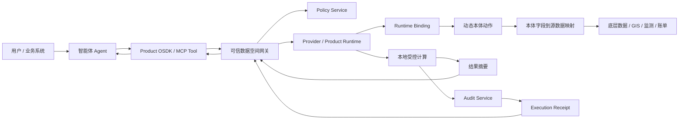
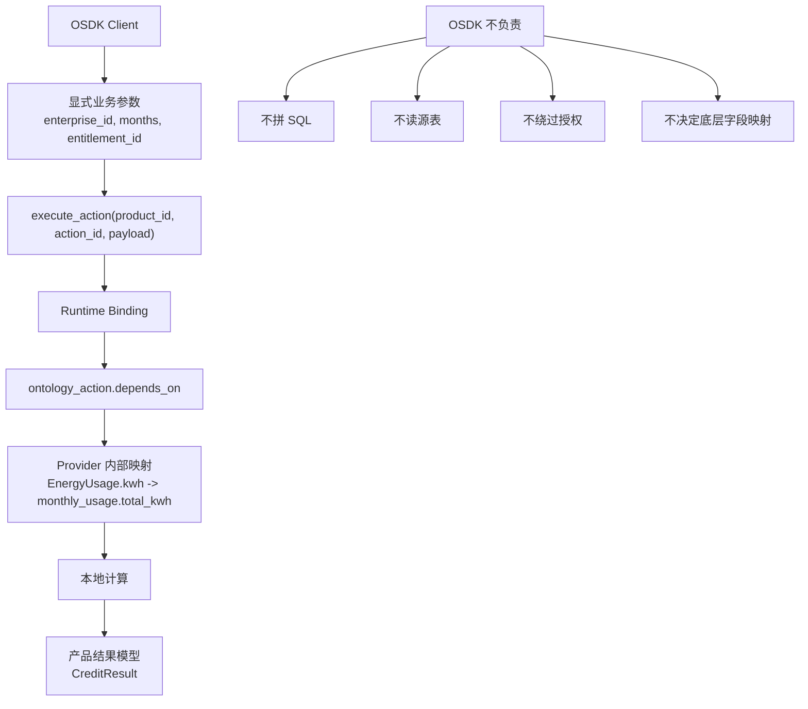
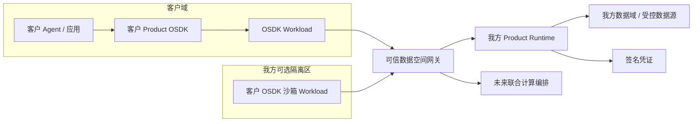

# 动态本体 OSDK Demo 演示、架构与实施门槛说明

本文面向方案评审、客户沟通和后续研发计划制定，融合说明当前 Demo 如何演示、系统架构如何理解，以及未来从原型走向真实实施时的技术门槛。

核心结论：

- OSDK 客户端本身不是最大难点。它主要是由产品投影生成的类型化调用面，确实接近对象映射和动作封装。
- 真正的难点不在 `client.compute_credit_features(...)` 这一层，而在 OSDK 背后的动态本体编译、策略授权、Runtime 绑定、可信数据空间网关、隔离运行、审计凭证和跨域联合计算。
- Demo 应该被理解为“用 OSDK 给 Agent 一个受控能力面”，而不是“用 OSDK 直接访问数据”。

## 1. 当前 Demo 要证明什么

当前 Demo Console 有四个 Tab：

| Tab | 演示重点 | 证明点 |
| --- | --- | --- |
| 用电征信 | 企业用电征信可信数据产品 | 同一 OSDK 动作可分别进入国家电网与综合能源两个异构 Provider Runtime 执行，原始数据不出域 |
| 长春开挖风险 | 城市生命线开挖风险产品 | 外部只提交工程参数，Runtime 内部使用坐标和规则计算风险，坐标不直接输出 |
| 动态本体运维 | 全量本体、产品投影、OSDK 编译裁剪 | 全量动态本体不等于产品 OSDK；产品接口是经过用途、分类分级和策略裁剪后的安全投影 |
| 部署视图 | OSDK workload、可信数据空间网关、Runtime | 客户侧运行 OSDK 或我方沙箱运行 OSDK 都可行，但实际计算仍通过网关进入受控 Runtime |

Demo 的一句话表达：

```text
Agent 不直接查数据库，而是调用由动态本体和产品投影生成的 Product OSDK；
OSDK 只暴露命名动作；
Runtime 在数据域内做本体映射、策略校验、实际计算和凭证签名。
```

## 2. 演示路径建议

建议用 12 到 15 分钟完成完整演示。

### 2.1 开场：先看价值闭环

打开 Demo Console：

```text
http://127.0.0.1:5173/
```

先看顶部“智能体 Agent 价值闭环”：

| 闭环 | 对应页面区域 | 说明 |
| --- | --- | --- |
| 发现 | 顶部意图条 + 产品 OSDK | Agent 读取产品目录和 OSDK/MCP 描述，而不是猜数据库表 |
| 授权 | 实时运行情况 + 授权指标 | 每次调用都要带用途、Provider、调用方、数据主体、期限和配额 |
| 编排 | 右侧执行明细 + 部署视图 | Agent 编排产品动作，不接触 SQL、连接串或原始文件 |
| 适配 | 动态本体运维 | 本体分类变化后，OSDK 接口会重新编译收缩 |
| 验证 | 凭证中心 / Receipt | 结果带授权、应用、本体、产品、Runtime 和 hash，可验证 |

### 2.2 用电征信

操作：

1. 进入“用电征信”。
2. 选择企业，例如 `91300000DEMO0007`。
3. 点击“查询征信”。

重点讲解：

- 前端只选择企业，不提交 SQL。
- Agent 调用 `EnterpriseEnergyCreditClient.compute_credit_features(...)`。
- `entitlement_id` 是授权许可编号，不是业务字段。
- 同一动作分别进入 `grid` 和 `integrated-energy` 两个 Provider Runtime。
- 每个 Runtime 本地映射自己的异构表，计算摘要。
- 银行侧只得到征信摘要和凭证。

OSDK 调用示例：

```python
client = EnterpriseEnergyCreditClient(runtime=provider_runtime)

credit_result = client.compute_credit_features(
    enterprise_id="91300000DEMO0007",
    months=12,
    entitlement_id="ent_demo",
)
```

这里的 `entitlement_id` 后续用于：

- Policy Service 校验授权是否存在、是否过期、是否撤销。
- 校验 product、purpose、requester、provider、output granularity 是否匹配。
- 写入 Execution Receipt，证明结果基于哪个授权产生。

### 2.3 长春开挖风险

操作：

1. 进入“长春开挖风险”。
2. 填写工程 ID、开挖深度、施工方式。
3. 点击“评估风险”。

重点讲解：

- 外部应用提交工程参数和开挖区域。
- 管线精确坐标、权属详情、监测摘要不出域。
- Runtime 内部使用 `PipelineSegment.exact_coordinates` 和 `ExcavationProject.excavation_area` 做空间规则计算。
- 返回风险等级、影响资产类型、影响段数、建议和凭证。

### 2.4 动态本体运维

操作：

1. 进入“动态本体运维”。
2. 先看“全量动态本体”。
3. 再看“产品投影”。
4. 再看“编译裁剪结果”。
5. 点击“重新编译 OSDK”。

重点讲解：

```text
全量动态本体很大。
产品只选择其中一部分对象、动作和输出。
Product Compiler 再根据分类分级、用途、质量门槛和 Runtime 能力裁剪成 Product OSDK。
```

示例：

| 字段 | 分类变化 | 编译结果 |
| --- | --- | --- |
| `PipelineSegment.exact_coordinates` | `INTERNAL_ONLY` -> `COMPUTE_ONLY` | 不生成读取接口，但 Runtime 内部风险评估动作仍可使用 |
| `PipelineSegment.owner_detail` | `HIDDEN` | 完全不进入 OSDK |
| `RiskAssessment.overall_risk` | `EXTERNAL_RESULT` | 可进入结果模型 |

### 2.5 部署视图

操作：

1. 进入“部署视图”。
2. 切换“客户侧 OSDK Workload”和“我方独立 OSDK 沙箱”。
3. 查看 `GatewayRuntimeAdapter` 代码。
4. 点击“模拟网关调用”。

重点讲解：

- OSDK 可以在客户侧运行。
- OSDK 也可以作为客户 workload 在我方隔离沙箱运行。
- 两种模式下，OSDK 都不能直连数据库或 Runtime 内网。
- OSDK workload 只能经可信数据空间网关调用 Runtime。
- 这为后续多方联合计算、联邦分析、TEE/MPC 编排留下统一入口。

## 3. 总体架构



分层理解：

| 层 | 作用 |
| --- | --- |
| Agent / 应用层 | 选择产品、申请授权、调用 OSDK、解释结果 |
| Product OSDK 层 | 提供类型化、命名化、受控的产品动作 |
| 可信数据空间网关 | 身份认证、合约校验、签名请求、路由、审计、跨域边界 |
| Policy Service | 校验 entitlement、用途、Provider、调用方、期限、配额、撤销 |
| Product Runtime | 执行 action，调用本体映射和本地计算逻辑 |
| 动态本体 / Runtime Binding | 把产品动作绑定到对象、字段、依赖和底层映射 |
| Audit / Receipt | 对输入输出、授权、版本、策略、Runtime 形成可验证凭证 |

## 4. OSDK 与 Runtime 的职责边界



关键区别：

| 项 | 含义 |
| --- | --- |
| `external_payload` | Agent 通过 OSDK 传入的业务参数和授权编号 |
| `entitlement_id` | Policy Service 签发的授权许可编号 |
| `depends_on` | Runtime 为完成本体动作，在数据域内部需要读取或计算的本体字段 |
| `runtime_binding` | 把 OSDK action 绑定到本体依赖和 Runtime 能力 |

因此：

```text
OSDK 参数不等于底层字段。
depends_on 不是外部传参，而是 Runtime 内部计算依赖。
```

## 5. 部署模型：客户侧 OSDK 与我方沙箱 OSDK

当前更通用的架构是：



两种运行方式：

| 方式 | 说明 | 适用情况 |
| --- | --- | --- |
| 客户侧 OSDK Workload | 客户在自己的环境运行 OSDK，出网只到可信数据空间网关 | 客户希望保留应用和 Agent 运行控制权 |
| 我方独立 OSDK 沙箱 | 客户 OSDK 包或调用逻辑在我方隔离沙箱运行，但仍经网关访问 Runtime | 客户希望我们托管运行环境，或需要降低接入复杂度 |

共同原则：

- OSDK workload 是独立 workload。
- OSDK workload 不直连数据库。
- OSDK workload 不直连 Runtime 内网。
- 所有调用都经可信数据空间网关。
- 网关记录请求签名、workload 身份、entitlement、产品合约和路由审计。

代码形态：

```python
gateway_runtime = GatewayRuntimeAdapter(
    gateway_url="https://tds-gateway.example.com",
    workload_id="customer-bank-agent",
    workload_attestation="sha256:workload-attestation",
    allowed_products=["enterprise-energy-credit"],
)

client = EnterpriseEnergyCreditClient(runtime=gateway_runtime)

result = client.compute_credit_features(
    enterprise_id="91300000DEMO0007",
    months=12,
    entitlement_id="ent_demo_gateway",
)
```

注意：这里的 `runtime` 被替换成 `GatewayRuntimeAdapter`，所以 OSDK 仍然是同一个调用面，但请求会被封装、签名并送到可信数据空间网关。

## 6. 为什么说 OSDK 本身不难

你的判断基本正确：如果只看 OSDK 客户端，它主要做三件事：

1. 生成产品 Client 类。
2. 暴露命名方法和类型化参数。
3. 把参数封装成 `product_id + action_id + payload` 发送给 Runtime 或网关。

这部分技术难度较低，接近：

```text
对象映射 + API Client + schema validation + 代码生成
```

如果仅做一个可用 SDK，难度大约是：

| 模块 | 难度 |
| --- | --- |
| Python OSDK 生成 | 低 |
| TypeScript OSDK 生成 | 低到中 |
| OpenAPI / MCP Tool 生成 | 低到中 |
| 参数 schema 校验 | 低到中 |
| SDK 包发布和版本管理 | 中 |

但这不是系统的核心壁垒。

## 7. 真正的实施门槛在哪里

真正难的是让这个 OSDK 调用“可信、可控、可演进、可运营”。

| 能力 | 难度 | 原因 |
| --- | --- | --- |
| 动态本体建模与治理 | 中到高 | 需要把客户数据、业务对象、动作、关系、分类分级、质量规则表达成稳定中间层 |
| Product Compiler | 中到高 | 要从全量本体裁剪出产品投影，并保证禁止字段不会泄漏 |
| Runtime Binding | 高 | 要把本体动作可靠映射到底层异构数据、GIS、文件、API 或流式数据 |
| Policy / Entitlement | 高 | 要覆盖用途、主体、Provider、期限、配额、撤销、输出粒度，并能审计 |
| 可信数据空间网关 | 高 | 要做身份、签名、路由、合约、审计、限流、租户隔离、跨域安全 |
| OSDK workload 隔离 | 高 | 客户侧或我方沙箱都需要网络策略、镜像证明、密钥管理和运行审计 |
| Execution Receipt | 中到高 | 要保证 hash、签名、版本、授权、策略决策可验证且防篡改 |
| 版本兼容与接口演进 | 中到高 | 本体变更后 OSDK、Runtime、应用、Agent 工具要协同升级 |
| 联合计算扩展 | 很高 | 多 Runtime 编排、联邦聚合、隐私计算、TEE/MPC 都会引入复杂协议和运维要求 |
| 生产运维 | 高 | 需要监控、重试、幂等、灾备、日志脱敏、密钥轮换、合规审计 |

一句话：

```text
OSDK 是易用入口，不是可信边界。
可信边界在 Runtime、Policy、Gateway、Sandbox 和 Receipt 这一整套系统里。
```

## 8. 原型到生产的建议路线

### 阶段 1：增强 Demo / PoC

目标：讲清楚价值，证明可行。

建议补强：

- 把 DOIR 从 Python fixture 切换到 YAML/JSON Registry。
- 生成真实可安装的 Python package。
- 生成 MCP Tool manifest 并让 Agent 真实调用。
- 增加网关模拟服务，而不是前端内置模拟。
- 增加撤销授权后的失败路径演示。

### 阶段 2：试点版

目标：接入一个真实或准真实数据域。

建议能力：

- SQLite/PostgreSQL Registry。
- 持久化 Policy Store。
- Runtime Adapter 支持 SQL、API、文件和 GIS 图层。
- Gateway 支持请求签名、租户隔离和审计日志。
- OSDK package 版本发布。
- Receipt Verifier 独立工具。

### 阶段 3：生产化

目标：可运营、可审计、可扩展。

重点能力：

- 多租户 IAM。
- KMS / 密钥轮换。
- OSDK workload sandbox。
- 网关高可用和限流。
- Runtime 执行队列、重试、幂等。
- 端到端审计和合规报表。
- 数据质量 SLA。
- 联合计算、隐私计算或 TEE/MPC 方案评估。

## 9. 风险判断

| 风险 | 判断 | 建议 |
| --- | --- | --- |
| 把 OSDK 误解成安全边界 | 高风险 | 明确 OSDK 只是调用面，安全边界必须在 Runtime/Gateway/Policy |
| 本体建模过度复杂 | 中风险 | 先围绕产品动作建模，不追求一次性全企业知识图谱 |
| Runtime 映射不可维护 | 高风险 | Runtime Binding 必须版本化、可测试、可回滚 |
| 凭证只做展示不可验证 | 中风险 | Receipt Verifier 要独立化，避免只在 UI 上显示 |
| 网关职责膨胀 | 中风险 | 网关只管信任、路由、审计和边界，不承载业务计算 |
| 联合计算过早复杂化 | 中风险 | 先做摘要级联邦编排，再评估 TEE/MPC |

## 10. 对外表达建议

不要把卖点说成“我们生成了一个 SDK”。更准确的表达是：

```text
我们用动态本体把异构数据能力编译成可被 Agent 安全调用的数据产品接口；
OSDK 是这个接口的开发者体验；
可信数据空间网关、Runtime、Policy 和 Receipt 才共同构成可信执行闭环。
```

客户容易理解的版本：

```text
客户或 Agent 像调用普通 SDK 一样调用数据产品；
但这个 SDK 不能越权、不能查原始表、不能绕过授权；
实际计算在受控 Runtime 内完成；
每次结果都有可验证凭证。
```

## 11. 结论

OSDK 本身确实不难，甚至应该保持简单。它越像普通 SDK，Agent 和开发者越容易使用。

难点和价值在于：

- 谁能调用。
- 为了什么用途调用。
- 调用进入哪个数据域。
- 底层数据如何映射到本体动作。
- 哪些字段只允许计算、不允许输出。
- 结果如何证明可信。
- 本体变化后接口如何自动收缩和兼容。
- OSDK workload 如何被隔离、审计并通过可信数据空间网关调用 Runtime。

因此，未来实施时应把 OSDK 视为“受控数据产品的前台入口”，把主要研发和治理投入放在“动态本体编译 + Runtime Binding + Policy/Gateway + Receipt + Sandbox”这条主线上。
