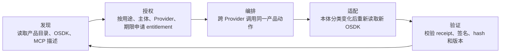
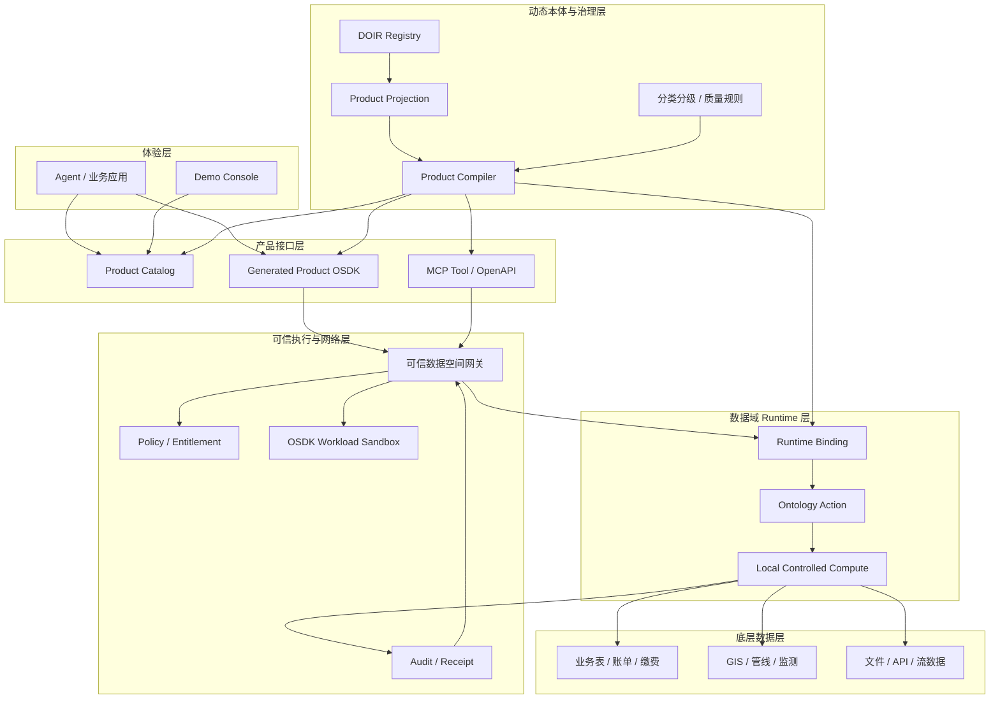
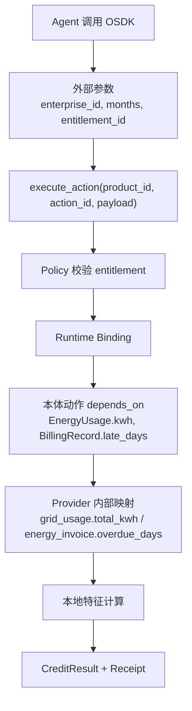
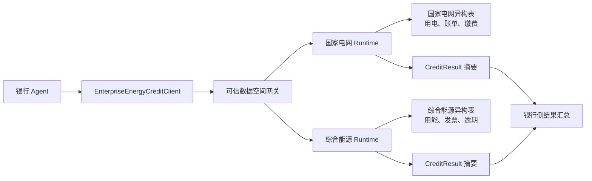
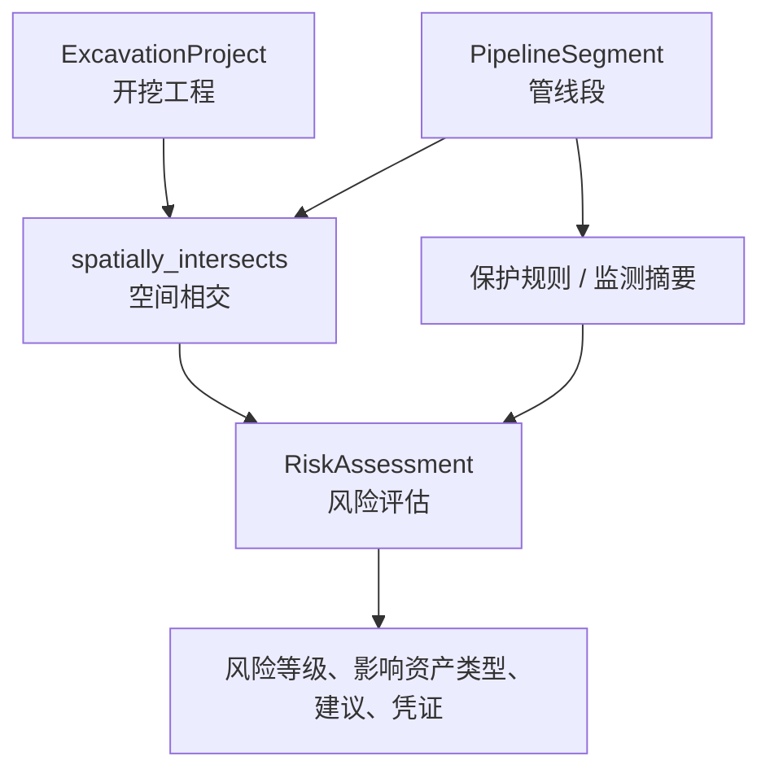
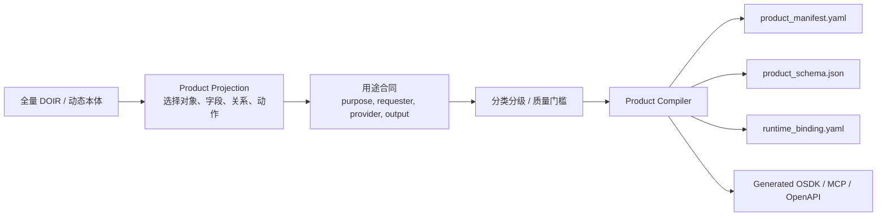
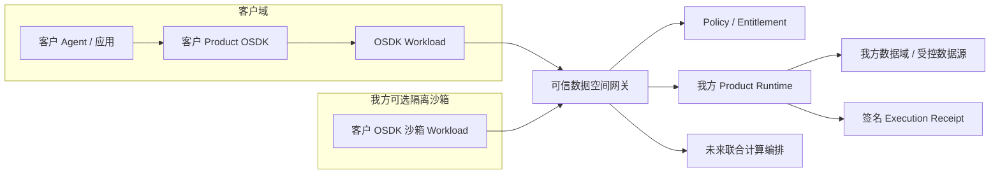

# 动态本体 OSDK 可信数据产品 Demo：演示说明与架构说明

版本：2026-07-16  
项目仓库：[seanzhang9999/dynamic-ontology-osdk-prototype](https://github.com/seanzhang9999/dynamic-ontology-osdk-prototype)  
本地演示入口：`http://127.0.0.1:5173/`

## 0. 核心判断

这个 Demo 不应被理解为“做了一个 SDK”。更准确的表达是：

> 用动态本体把异构数据能力编译成可被 Agent 安全调用的数据产品接口；OSDK 是这个接口的开发者体验，可信数据空间网关、Runtime、Policy 和 Receipt 才共同构成可信执行闭环。

OSDK 客户端本身并不复杂。它主要是类型化方法、参数校验、动作封装和 Runtime/Gateway 调用，类似“对象映射 + API Client + Schema Validation + 代码生成”。真正的工程难度在于 OSDK 背后的机制：

- 动态本体如何表达对象、字段、关系、动作、分类分级和质量规则。
- Product Compiler 如何从全量本体裁剪出某个产品允许暴露的接口。
- Runtime Binding 如何把本体动作稳定绑定到底层异构表、GIS、文件、API 或流式数据。
- Policy/Entitlement 如何判断谁能为哪个用途调用哪个产品。
- 可信数据空间网关如何做身份、签名、路由、审计和跨域边界控制。
- Receipt 如何证明一次结果来自指定授权、应用、本体版本、产品版本和 Runtime。

因此，Demo 的主线应该是：

```text
Agent 不直接查数据库，而是发现并调用 Product OSDK。
OSDK 不暴露 SQL、连接串、原始文件或底层表字段，只暴露命名动作。
可信数据空间网关和 Provider Runtime 在数据域内完成授权校验、本体映射、实际计算和凭证签名。
```

## 1. 演示页面如何组织

当前 Demo Console 分为四个主要视图：

| 视图 | 主要问题 | 证明点 |
| --- | --- | --- |
| 用电征信 | 银行如何查询企业用电征信数据产品 | 同一 OSDK 动作可分别进入国家电网和综合能源两个异构 Provider Runtime 执行，原始数据不出域 |
| 长春开挖风险 | 施工方如何评估开挖风险 | 外部只提交工程参数，Runtime 内部使用管线坐标和规则计算风险，精确坐标不输出 |
| 动态本体运维 | 本体到底是什么，OSDK 为什么只暴露一部分 | 全量动态本体经过用途、分类分级、质量门槛和产品投影编译，生成收缩后的 Product OSDK |
| 部署视图 | OSDK 在哪里运行，如何经可信网络调用 Runtime | OSDK workload 可以在客户侧运行，也可以在我方独立沙箱运行，但都必须经可信数据空间网关访问 Runtime |

页面的基本阅读顺序是：

1. 先看顶部 Agent 价值闭环，理解每个环节解决什么问题。
2. 再进入某个业务场景，选择企业或工程参数，触发查询/评估。
3. 左侧看业务结果、本体结构和底层数据样例。
4. 右侧看实时执行步骤，理解 OSDK、Gateway、Policy、Runtime 和 Receipt 如何协作。
5. 最后进入动态本体运维和部署视图，说明接口为什么会变化、运行边界在哪里。


## 2. Agent 价值闭环

Agent 的价值不在于“能调用一个 API”，而在于它可以在受控边界内自动完成发现、授权、编排、适配和验证。



| 环节 | Agent 做什么 | 平台保证什么 |
| --- | --- | --- |
| 发现 | 读取产品目录、OSDK/MCP 描述，知道有哪些可信数据产品可调用 | 产品能力以机器可读形式发布，不要求 Agent 猜表结构 |
| 授权 | 按用途、数据域、调用方和期限申请 entitlement | Policy Service 统一判断授权是否存在、过期、撤销、超配额 |
| 编排 | 调用同一产品动作访问多个 Provider Runtime | OSDK 不接触连接串、SQL、原始文件或底层表字段 |
| 适配 | 本体分类变化后重新读取新 OSDK，避开已收缩接口 | Product Compiler 重新生成接口，禁止字段不会泄漏 |
| 验证 | 拿到结果后验证 receipt | Receipt 记录授权、应用、本体、产品、Runtime、输入输出 hash 和签名 |

这个闭环对应 Demo 页面上的四类信息：

| 页面区域 | 对应价值 |
| --- | --- |
| 顶部价值说明和产品目录 | 发现 |
| 授权编号、用途、期限、调用方、Provider | 授权 |
| OSDK 调用代码、实时执行步骤 | 编排 |
| 动态本体运维中的编译裁剪结果 | 适配 |
| 凭证中心、hash、签名、Receipt Verifier | 验证 |

## 3. 总体框架结构




分层解释：

| 层 | 作用 |
| --- | --- |
| 体验层 | 给业务人员、开发者和 Agent 展示产品、结果、执行过程和凭证 |
| 产品接口层 | 把数据产品发布成 Product Catalog、OSDK、MCP Tool 和 OpenAPI |
| 可信执行与网络层 | 负责身份、授权、签名、路由、沙箱隔离、审计和凭证 |
| Runtime 层 | 在数据域内执行命名动作，完成本体映射和本地受控计算 |
| 动态本体与治理层 | 维护对象、字段、关系、动作、分类分级、质量规则和产品投影 |
| 底层数据层 | 真实数据所在位置，可以是表、GIS、文件、API 或流式数据 |

## 4. OSDK 的实际情况

### 4.1 OSDK 是什么

Product OSDK 是由动态本体和产品投影生成的“受控调用面”。它把一个数据产品暴露成开发者和 Agent 容易理解的类型化方法，例如：

```python
class EnterpriseEnergyCreditClient:
    def __init__(self, runtime):
        self.runtime = runtime

    def compute_credit_features(
        self,
        enterprise_id: str,
        months: int,
        entitlement_id: str,
    ) -> CreditResult:
        payload = {
            "enterprise_id": enterprise_id,
            "months": months,
            "entitlement_id": entitlement_id,
        }
        return self.runtime.execute_action(
            product_id="enterprise-energy-credit",
            action_id="compute_credit_features",
            payload=payload,
        )
```

Agent 或业务应用看到的是：

```python
client = EnterpriseEnergyCreditClient(runtime=gateway_runtime)

result = client.compute_credit_features(
    enterprise_id="91300000DEMO0007",
    months=12,
    entitlement_id="ent_cddf8c7d872e",
)
```

### 4.2 entitlement_id 是什么

`entitlement_id` 是一次授权许可的编号，不是业务字段，也不是企业 ID。它代表“谁、为了什么用途、在什么期限内、可以调用哪个产品、访问哪个 Provider、输出到什么粒度”。

在执行链路中，`entitlement_id` 会被用在三个位置：

1. OSDK 把它作为 payload 的一部分传给 Gateway/Runtime。
2. Policy Service 用它查授权记录并判断是否允许执行。
3. Audit Service 把它写入 Execution Receipt，证明结果基于哪个授权产生。

简化后的执行逻辑：

```python
decision = policy.evaluate(
    entitlement_id=payload["entitlement_id"],
    product_id="enterprise-energy-credit",
    action_id="compute_credit_features",
    purpose="credit_assessment",
    requester_agent="bank-credit-agent",
    provider_agent="grid-runtime",
)

if not decision.allow:
    raise PolicyDenied(decision.reason)

result = runtime.compute_credit_features(payload)
receipt = audit.sign_receipt(
    entitlement_id=payload["entitlement_id"],
    policy_decision=decision.to_dict(),
    output_hash=sha256_json(result),
)
```

所以它的意义类似“可审计的调用许可证编号”。没有它，OSDK 仍然可以构造方法调用，但 Runtime/Policy 应拒绝执行。

### 4.3 depends_on 与 OSDK 传参为什么不一样

页面中会展示这样的绑定关系：

```yaml
action: compute_credit_features
depends_on:
  - EnergyUsage.kwh
  - BillingRecord.late_days
returns: CreditResult
```

这不是说 Agent 要把 `EnergyUsage.kwh` 或 `BillingRecord.late_days` 作为参数传进来。真正含义是：

| 项 | 面向谁 | 含义 |
| --- | --- | --- |
| `enterprise_id`, `months`, `entitlement_id` | Agent / OSDK 调用方 | 外部允许传入的业务参数和授权编号 |
| `depends_on` | Runtime / Product Compiler | 为完成这个动作，Runtime 在数据域内部需要读取或计算哪些本体字段 |
| `runtime_binding` | Runtime | 把本体字段映射到底层 Provider 自己的数据表、GIS 图层、API 或文件 |

对应关系如下：



一句话：

```text
OSDK 参数是外部调用合约；depends_on 是 Runtime 内部计算依赖。
```

### 4.4 OSDK 不是安全边界

OSDK 应该尽量简单，越像普通 SDK 越容易被开发者和 Agent 使用。但安全边界不在 OSDK 客户端里，而在：

- Gateway：请求签名、身份、路由、跨域边界、审计。
- Policy：授权、用途、期限、配额、撤销、输出粒度。
- Runtime：本地执行、底层映射、禁止原始数据出域。
- Sandbox：隔离客户 OSDK workload，限制网络和文件访问。
- Receipt：对执行事实进行签名和防篡改验证。

## 5. 用电征信场景

用电征信不是“把两个地方的数据全部搜索后合并原始数据”。更准确的流程是：

1. 同一银行 Agent 使用同一个 Product OSDK 动作。
2. 该动作可分别路由到国家电网 Runtime 和综合能源 Runtime。
3. 每个 Runtime 在自己的数据域内完成本体映射和特征计算。
4. 结果以标准 `CreditResult` 结构返回，通常是摘要、评分、解释和质量快照。
5. 如果需要跨 Provider 汇总，汇总的是产品结果或特征摘要，不是原始账单、缴费流水或连接串。



演示时应强调：

- 银行侧看不到底层表名、连接串或原始流水。
- 同一应用包可以在两个 Provider Runtime 中执行。
- 两个 Provider 的底层表结构可以不同，但都映射到统一领域本体。
- 授权撤销后，下一次执行应失败，并在实时运行情况中记录拒绝原因。


## 6. 长春开挖风险场景

长春场景用来说明“数据不出域，但计算可以使用敏感字段”。例如管线精确坐标可能被升级为核心数据：

| 字段 | 分类 | 外部接口 | Runtime 内部 |
| --- | --- | --- | --- |
| `PipelineSegment.exact_coordinates` | `COMPUTE_ONLY` | 不生成读取接口 | 风险评估动作可使用 |
| `PipelineSegment.owner_detail` | `HIDDEN` | 完全不暴露 | 默认不可用 |
| `RiskAssessment.overall_risk` | `EXTERNAL_RESULT` | 可返回 | 可写入结果 |

用户或 Agent 传入的是：

```python
result = client.assess_excavation_risk(
    project_id="cc-demo-2026-001",
    excavation_area=geojson_polygon,
    depth_m=4.5,
    construction_method="mechanical",
    entitlement_id="ent_changchun_demo",
)
```

Runtime 内部会使用 GIS intersection、buffer、距离和规则评分，返回风险等级、影响资产类型、影响段数、建议、质量摘要和凭证。



## 7. 动态本体运维与编译裁剪

动态本体运维视图要讲清楚一个关键点：

```text
全量动态本体 != Product OSDK。
Product OSDK 是全量本体经过产品投影、用途合同、分类分级、质量门槛和 Runtime 能力裁剪后的结果。
```


典型编译规则：

| 分类 | 编译行为 |
| --- | --- |
| `HIDDEN` | 不生成接口，不进入结果模型 |
| `INTERNAL_ONLY` | 默认仅 Runtime 内部可见 |
| `COMPUTE_ONLY` | 不生成读取接口，但可作为受控动作内部依赖 |
| `MASKED` | 只能生成脱敏后的结果字段 |
| `AGGREGATE_ONLY` | 只生成聚合查询，不生成明细读取 |
| `EXTERNAL_RESULT` | 可出现在产品结果模型中 |

产品编译链路：



这个机制与传统“建一个大而全的数据中台再给应用查表”不同。动态本体不是直接给外部暴露数据，而是让数据产品以动作方式被编译、授权、执行和验证。

## 8. 部署视图：客户侧 OSDK 与我方沙箱 OSDK

更通用的部署方式是把客户的 OSDK 调用视为一个独立 workload。这个 workload 可以运行在客户侧，也可以运行在我方托管沙箱，但都必须经过可信数据空间网关才能调用 Runtime。




代码形态：

```python
gateway_runtime = GatewayRuntimeAdapter(
    gateway_url="https://tds-gateway.example.com",
    workload_id="customer-bank-agent",
    workload_attestation="sha256:workload-attestation",
    allowed_products=["enterprise-energy-credit"],
)

client = EnterpriseEnergyCreditClient(runtime=gateway_runtime)

result = client.compute_credit_features(
    enterprise_id="91300000DEMO0007",
    months=12,
    entitlement_id="ent_demo_gateway",
)
```

这里 `runtime` 被替换为 `GatewayRuntimeAdapter`，所以 OSDK 调用面不变，但请求会被封装、签名并送到可信数据空间网关。网关再完成身份校验、授权校验、路由、审计和 Runtime 调用。


## 9. Execution Receipt 是什么

Execution Receipt 是一次受控数据产品执行后的“可验证执行凭证”。它不是简单日志，而是面向结果可信性的结构化证据。

Receipt 至少应该包含：

```json
{
  "request_id": "req_20260716_0001",
  "purpose": "credit_assessment",
  "requester_agent": "bank-credit-agent",
  "provider_agent": "grid-runtime",
  "data_subject": "91300000DEMO0007",
  "entitlement_id": "ent_cddf8c7d872e",
  "application_digest": "sha256:...",
  "ontology_version": "doir-v0.2.3",
  "mapping_version": "grid-map-v0.4.1",
  "product_version": "enterprise-energy-credit-v0.2.0",
  "runtime_version": "grid-runtime-v0.3.0",
  "input_hash": "sha256:...",
  "output_hash": "sha256:...",
  "policy_decision": "allow",
  "previous_event_hash": "sha256:...",
  "provider_signature": "ed25519:..."
}
```

它回答的问题是：

| 问题 | Receipt 中的证据 |
| --- | --- |
| 谁调用的 | `requester_agent` |
| 为了什么用途 | `purpose` |
| 基于哪个授权 | `entitlement_id` |
| 哪个应用包发起 | `application_digest` |
| 使用哪个本体/映射/产品版本 | `ontology_version`, `mapping_version`, `product_version` |
| 哪个 Runtime 执行 | `provider_agent`, `runtime_version` |
| 输入输出是否被篡改 | `input_hash`, `output_hash` |
| 策略是否允许 | `policy_decision` |
| 凭证链是否连续 | `previous_event_hash` |
| 谁签名背书 | `provider_signature` |

验证时并不需要看到原始数据。验证方可以重新计算输入输出摘要，校验签名和 hash 链，从而判断“这份结果是否来自指定授权和指定产品执行”。

## 10. 与传统方案的差异

| 传统方案 | 常见问题 | 本机制的改进 |
| --- | --- | --- |
| 数据中台 / 数据湖 | 往往强调汇聚和统一存储，容易形成原始数据出域或大权限查询 | Runtime 在数据域内执行，外部只拿产品结果和凭证 |
| API 开放平台 | API 多为手工定义，接口与底层数据治理割裂 | OSDK/MCP/OpenAPI 由动态本体和产品投影编译生成 |
| 传统动态本体 / 知识图谱 | 偏建模和查询，未必解决授权、执行和结果可信 | 本体动作绑定 Runtime、Policy 和 Receipt，直接进入可调用产品 |
| 数据交易 | 交易对象常被理解为数据集或文件 | 交易对象变成可授权、可执行、可验证的数据产品动作 |
| 普通 SDK / ORM | 开发体验好，但容易让调用方靠近底层数据模型 | Product OSDK 只暴露命名动作，不暴露自由 SQL 和底层字段 |
| Agent 直接连库 | 快但不可控，难审计，难合规 | Agent 只能通过 OSDK/MCP 调用受控产品，并拿到可验证凭证 |

核心差异是：

```text
传统方案常把“数据可访问”作为目标；
本机制把“数据能力可被授权、可被执行、可被验证”作为目标。
```

## 11. 实施门槛评估

### 11.1 难度较低的部分

| 模块 | 难度 | 说明 |
| --- | --- | --- |
| Python OSDK 生成 | 低 | 本质是根据产品 schema 生成 Client、参数模型和返回模型 |
| TypeScript OSDK 生成 | 低到中 | 需要处理前端类型、包发布和版本兼容 |
| MCP Tool / OpenAPI 生成 | 低到中 | 从产品动作和 schema 生成机器可读工具描述 |
| 参数校验 | 低到中 | 可依赖 Pydantic、JSON Schema、OpenAPI |
| Demo Console 展示 | 中 | 难点主要是叙事清晰和执行链路可视化 |

### 11.2 真正困难的部分

| 模块 | 难度 | 原因 |
| --- | --- | --- |
| 动态本体建模与治理 | 中到高 | 要表达对象、字段、关系、动作、分类分级、质量规则和版本演进 |
| Product Compiler | 中到高 | 要保证禁止字段不会进入接口、结果模型或间接泄漏路径 |
| Runtime Binding | 高 | 要把本体动作稳定映射到异构表、GIS、API、文件和流数据，并可测试、可回滚 |
| Policy / Entitlement | 高 | 要覆盖用途、主体、Provider、期限、配额、撤销、输出粒度和审计 |
| 可信数据空间网关 | 高 | 要做身份、签名、路由、合约、审计、限流、租户隔离和跨域安全 |
| OSDK workload 隔离 | 高 | 客户侧或我方沙箱都需要网络策略、镜像证明、密钥管理和运行审计 |
| Execution Receipt | 中到高 | 要让 hash、签名、版本、授权、策略决策可验证且防篡改 |
| 版本兼容与接口演进 | 中到高 | 本体变化后 OSDK、Runtime、应用和 Agent 工具要协同升级 |
| 联合计算扩展 | 很高 | 多 Runtime 编排、联邦聚合、隐私计算、TEE/MPC 会引入协议和运维复杂度 |

### 11.3 一句话结论

```text
OSDK 是易用入口，不是可信边界。
可信边界在 Runtime、Policy、Gateway、Sandbox 和 Receipt 这一整套系统中。
```

## 12. 后续研发建议

### 阶段 1：增强 Demo / PoC

目标是讲清楚价值并证明机制可行。

- 把 DOIR 从 Python fixture 切换到 YAML/JSON Registry。
- 生成真实可安装的 Python package。
- 生成 MCP Tool manifest，并让 Agent 通过真实工具描述调用。
- 增加网关模拟服务，而不是只在前端内置模拟。
- 增加授权撤销后的失败路径演示。
- 增加 Receipt Verifier 的独立命令行工具。

### 阶段 2：试点版

目标是接入一个真实或准真实数据域。

- SQLite/PostgreSQL Registry。
- 持久化 Policy Store。
- Runtime Adapter 支持 SQL、API、文件和 GIS 图层。
- Gateway 支持请求签名、租户隔离和审计日志。
- OSDK package 版本发布。
- 前端展示真实编译前后差异和策略拒绝记录。

### 阶段 3：生产化

目标是可运营、可审计、可扩展。

- 多租户 IAM。
- KMS / 密钥轮换。
- OSDK workload sandbox。
- 网关高可用和限流。
- Runtime 执行队列、重试、幂等。
- 端到端审计和合规报表。
- 数据质量 SLA。
- 联合计算、隐私计算或 TEE/MPC 方案评估。

## 13. 对外表达建议

建议避免这样讲：

```text
我们生成了一个 OSDK。
```

建议这样讲：

```text
我们把动态本体治理后的数据能力编译成可被 Agent 调用的数据产品接口。
客户或 Agent 像调用普通 SDK 一样调用产品动作；
但这个 SDK 不能越权、不能查原始表、不能绕过授权。
实际计算在受控 Runtime 内完成，每次结果都有可验证凭证。
```

更短的客户版表达：

```text
像调 SDK 一样调数据产品；
像走数据空间一样受控流转；
像验签一样验证结果可信。
```

## 附录 A：当前 Demo 截图

### A.1 Agent 价值闭环与用电征信工作台


### A.2 用电征信执行链路


### A.3 动态本体运维


### A.4 部署拓扑和代码


### A.5 网关执行链路


## 附录 B：框架结构图


## 附录 C：术语表

| 术语 | 说明 |
| --- | --- |
| DOIR | Dynamic Ontology Intermediate Representation，动态本体中间表示 |
| Product Projection | 从全量本体中选择某个产品需要暴露的对象、字段、关系和动作 |
| Product Compiler | 根据产品投影、用途、分类分级、质量门槛和 Runtime 能力生成产品发布包 |
| Product OSDK | 面向开发者和 Agent 的受控 SDK，只暴露命名 Query/Action |
| MCP Tool | 面向 Agent 的机器可读工具描述，使 Agent 能发现和调用产品能力 |
| Runtime Binding | 把产品动作和本体依赖绑定到底层数据域执行能力 |
| Entitlement | 授权许可，描述谁为了什么用途在什么范围内可以调用哪个产品 |
| Trusted Data Space Gateway | 可信数据空间网关，负责身份、签名、合约、路由、审计和跨域边界 |
| Execution Receipt | 执行凭证，证明一次结果基于指定授权、应用、本体、产品和 Runtime 产生 |

