# 动态本体 OSDK 可信数据产品 Demo：从问题到演示的完整说明

版本：2026-07-16  
项目仓库：[seanzhang9999/dynamic-ontology-osdk-prototype](https://github.com/seanzhang9999/dynamic-ontology-osdk-prototype)  
本地演示入口：`http://127.0.0.1:5173/`

## 1. 我们想解决什么目标

这个 Demo 的目标不是证明“我们能生成一个 SDK”。如果只是生成 SDK，技术难度并不高，也不能形成真正的可信数据产品能力。

这个 Demo 真正想证明的是：

```text
把不同数据域里的结构化数据、非结构化数据、GIS 数据和业务规则，
映射成动态本体中间层；
再把动态本体按用途、授权、分类分级和质量规则编译成数据产品；
最后把数据产品暴露成 Agent 可安全调用的 Product OSDK / MCP Tool。
```

换成业务语言，就是：

```text
客户或 Agent 像调用普通 SDK 一样调用数据产品；
但它不能越权、不能查原始表、不能绕过授权、不能拿走敏感明细；
实际计算在数据域 Runtime 内完成；
每次结果都带可验证凭证。
```

### 1.1 目标读者需要先理解的几个概念

| 概念 | 简单解释 |
| --- | --- |
| 动态本体 | 对业务对象、字段、关系、动作和规则的统一表达，例如企业、用电记录、账单、管线、开挖工程和风险评估 |
| 数据产品 | 不是一张表或一个文件，而是一个被授权、可执行、可验证的能力，例如“计算企业用电征信特征” |
| Product OSDK | 由数据产品生成的 SDK，只暴露命名动作，不暴露 SQL、连接串、原始文件和底层字段 |
| Runtime | 数据域内的执行环境，负责把本体动作映射到底层数据并完成本地计算 |
| Entitlement | 授权许可，说明谁为了什么用途，在什么期限和范围内可以调用哪个产品 |
| Receipt | 执行凭证，证明结果来自某个授权、某个应用、某个本体版本、某个产品版本和某个 Runtime |
| 可信数据空间网关 | OSDK workload 和 Runtime 之间的可信边界，负责身份、签名、授权、路由和审计 |

### 1.2 Demo 最终要让人相信什么

| 要证明的事 | Demo 中如何体现 |
| --- | --- |
| 数据可以不出域 | 银行侧只得到征信摘要、评分、解释和凭证，不得到原始账单或缴费流水 |
| 同一应用可以跨异构 Provider | 同一个企业用电征信 OSDK 动作分别进入国家电网 Runtime 和综合能源 Runtime |
| 本体不是展示概念，而是编译源 | 动态本体运维中能看到全量本体、产品投影、编译裁剪和接口变化 |
| Agent 有真实价值 | Agent 发现产品、申请授权、调用 OSDK、适配接口变化、验证 Receipt |
| 安全边界不靠 SDK 自觉 | Policy、Gateway、Runtime、Sandbox 和 Receipt 共同约束调用 |

## 2. 现有方案通常有什么问题

如果没有动态本体、产品编译和可信执行闭环，常见做法会落到几类方案：数据中台、API 开放、数据交易、知识图谱查询、普通 SDK 或 Agent 直连数据库。它们各有价值，但很难同时满足“可用、可控、可审计、可演进、适合 Agent 编排”。

### 2.1 数据中台的问题

数据中台通常强调数据汇聚、统一建模和统一查询。它的优势是集中管理，问题是：

- 容易把目标变成“让更多人查更多数据”。
- 权限边界经常停留在库表、目录或接口级别，难表达“为了某个用途只能输出某种结果”。
- 原始数据或明细数据容易被复制、导出或二次扩散。
- Agent 如果接入数据中台，往往还是要理解表、字段、SQL 和权限细节。

### 2.2 API 开放平台的问题

API 可以把能力暴露出去，但传统 API 往往是手工定义的：

- API 和数据治理规则容易分离。
- 字段分类变化后，接口不一定自动收缩。
- 不同 Provider 的 API 语义不统一，Agent 编排时需要做很多适配。
- API 调用日志不等于结果可信凭证，后续很难证明“这个结果基于哪个授权和哪个数据产品版本产生”。

### 2.3 数据交易的问题

很多数据交易方案把交易对象理解为数据集、文件、接口调用次数或查询权限。问题是：

- 交易完成后，很难持续控制数据如何被使用。
- 交付对象如果是明细数据，天然存在出域和扩散风险。
- 如果交付对象只是 API，又缺少本体、策略和凭证联动。
- 数据产品的质量、版本、用途和执行证据难形成闭环。

### 2.4 传统动态本体或知识图谱的问题

动态本体和知识图谱擅长表达对象、关系和语义，但如果只停留在建模和查询，也会有问题：

- 它解释了“数据是什么”，但未必解决“谁能用、为了什么用、怎么安全执行”。
- 它可能提供图查询能力，但不一定能生成可被 Agent 安全调用的产品接口。
- 它可能描述敏感字段，但不一定能把分类分级编译成接口收缩。

### 2.5 普通 SDK 或 ORM 的问题

普通 SDK/ORM 的开发体验很好，但它们通常靠近底层数据模型：

- 容易把表、字段、查询能力暴露给调用方。
- 很难表达“字段可参与计算但不可输出”。
- SDK 本身不是安全边界，调用方拿到 SDK 后仍可能尝试绕过规则。

### 2.6 Agent 直接访问数据的问题

Agent 直接连库、读文件、写 SQL，看起来效率高，但风险最大：

- Agent 可能误读字段、误拼 SQL 或误用数据。
- 审计困难，不容易解释每一步结果如何产生。
- 权限过大时容易泄漏原始数据。
- 本体、授权、质量和凭证无法自然进入执行链路。

### 2.7 对问题的总结

```text
传统方案常把“数据可访问”作为目标；
我们要把目标改成“数据能力可被授权、可被执行、可被验证、可被 Agent 编排”。
```

## 3. 我们的解决思路

我们的解决思路是把“数据访问”改造成“可信数据产品执行”。

### 3.1 从源数据到动态本体

不同 Provider 的底层数据可以完全不同。例如：

| Provider | 可能的底层数据 |
| --- | --- |
| 国家电网 | 企业档案表、月度用电表、账单表、缴费流水 |
| 综合能源 | 客户表、能耗发票表、逾期记录、合同信息 |
| 城市生命线 | 管线 GIS 图层、监测摘要、历史隐患、保护规则、开挖工程参数 |

这些数据先被映射到动态本体中间层：

```text
Enterprise
EnergyUsage
BillingRecord
PaymentBehavior
PipelineSegment
ExcavationProject
RiskAssessment
```

动态本体不是为了好看，而是为了让后续产品编译、OSDK 生成、Runtime 执行和 Agent 发现都基于同一套语义。

### 3.2 从全量本体到产品投影

全量本体通常很大，但一个数据产品只应该暴露其中一部分。

例如“企业用电征信产品”只需要：

- 企业标识。
- 最近 12 个月用电稳定性。
- 覆盖月数。
- 逾期次数区间。
- 缴费行为摘要。
- 数据质量摘要。
- 征信解释和执行凭证。

它不应该暴露：

- 原始逐月用电明细。
- 原始缴费流水。
- 连接串。
- 底层表字段。
- Provider 内部敏感字段。

### 3.3 从产品投影到 Product OSDK

Product Compiler 会根据产品投影、用途合同、分类分级、质量门槛和 Runtime 能力，生成：

| 编译输出 | 作用 |
| --- | --- |
| `product_manifest.yaml` | 产品身份、用途、版本和动作声明 |
| `product_schema.json` | 输入输出模型 |
| `runtime_binding.yaml` | 本体动作如何绑定 Runtime 能力 |
| `quality_certificate.json` | 数据质量口径 |
| Python Product OSDK | 给应用和 Agent 调用 |
| MCP Tool / OpenAPI | 给 Agent 和系统发现、编排 |

### 3.4 分类分级如何影响接口

分类分级不是文档标签，而会影响编译结果：

| 分类 | 编译行为 |
| --- | --- |
| `HIDDEN` | 不生成接口，不进入结果模型 |
| `INTERNAL_ONLY` | 默认仅 Runtime 内部可见 |
| `COMPUTE_ONLY` | 不生成读取接口，但可作为受控动作内部依赖 |
| `MASKED` | 只能生成脱敏后的结果字段 |
| `AGGREGATE_ONLY` | 只生成聚合查询，不生成明细读取 |
| `EXTERNAL_RESULT` | 可出现在产品结果模型中 |

这正是 Demo 要表现的“动态”：当字段分类变化后，OSDK 调用面会重新编译并收缩。

### 3.5 Agent 在这个机制中的价值

Agent 的价值不在于绕过系统去直接拿数据，而是在可信边界内完成复杂编排：

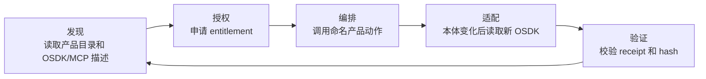

| 环节 | Agent 做什么 | 平台保证什么 |
| --- | --- | --- |
| 发现 | 读取产品目录、OSDK/MCP 描述，知道有哪些可信数据产品可调用 | 能力以机器可读形式发布，不要求 Agent 猜表结构 |
| 授权 | 按用途、数据域、调用方和期限申请 entitlement | Policy Service 判断授权是否存在、过期、撤销、超配额 |
| 编排 | 跨 Provider 调用同一产品动作 | OSDK 不接触 SQL、连接串、原始文件或底层表字段 |
| 适配 | 本体分类变化后重新读取新 OSDK | Product Compiler 保证禁止字段不会进入接口 |
| 验证 | 拿到结果后验证 Receipt | Receipt 记录授权、应用、本体、产品、Runtime、输入输出 hash 和签名 |

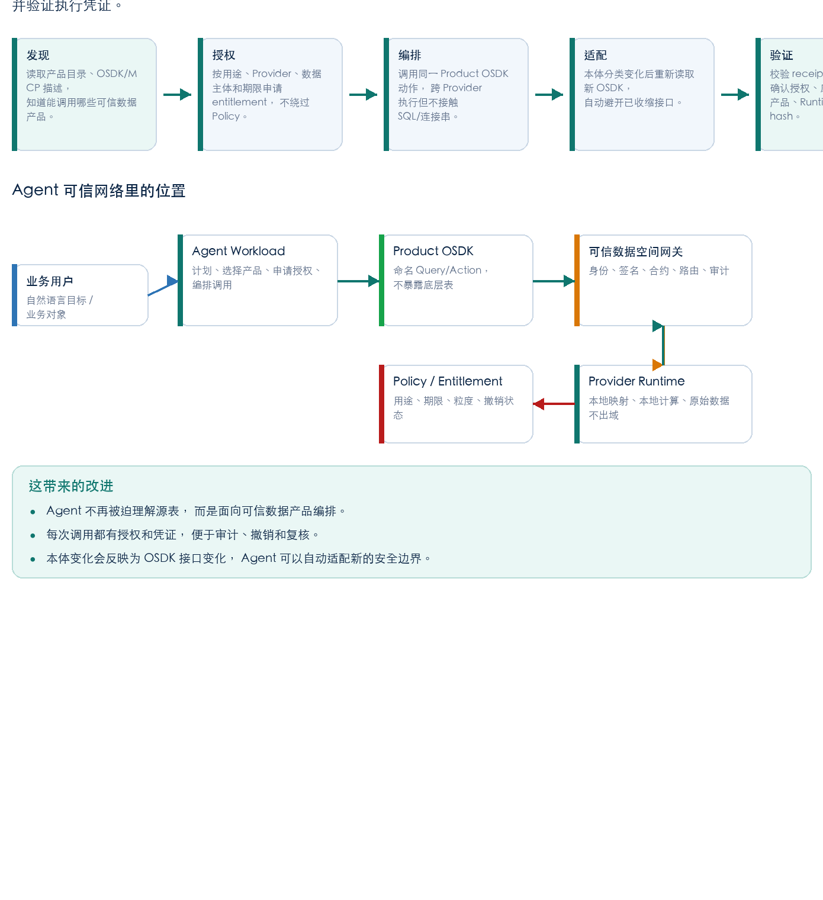

## 4. 总体架构

整个系统可以分为六层。

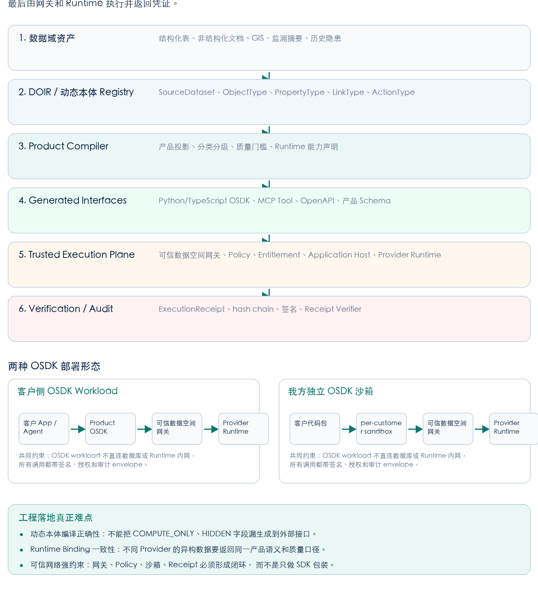

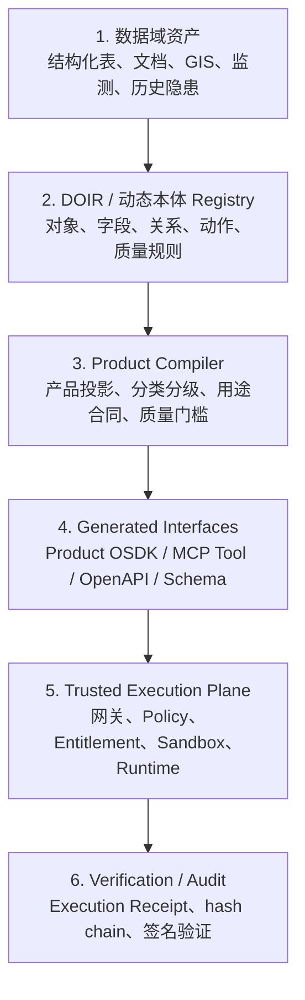

### 4.1 各层职责

| 层 | 职责 | 不做什么 |
| --- | --- | --- |
| 数据域资产 | 保存真实数据和原始业务系统 | 不直接对外暴露原始数据 |
| DOIR / 动态本体 Registry | 统一表达对象、字段、关系、动作、质量和分类 | 不等同于对外接口 |
| Product Compiler | 把全量本体裁剪成某个产品的安全投影 | 不允许绕过分类分级 |
| Generated Interfaces | 生成 OSDK、MCP、OpenAPI 和 Schema | 不暴露自由 SQL、连接串、原始文件 |
| Trusted Execution Plane | 完成身份、授权、路由、沙箱、Runtime 执行和审计 | 不把安全寄托在 SDK 客户端 |
| Verification / Audit | 生成可验证凭证，支持复核和追责 | 不要求验证方看到原始数据 |

### 4.2 OSDK 的真实位置

OSDK 是调用体验，不是可信边界。它做的事情主要是：

```python
class EnterpriseEnergyCreditClient:
    def __init__(self, runtime):
        self.runtime = runtime

    def compute_credit_features(
        self,
        enterprise_id: str,
        months: int,
        entitlement_id: str,
    ) -> CreditResult:
        payload = {
            "enterprise_id": enterprise_id,
            "months": months,
            "entitlement_id": entitlement_id,
        }
        return self.runtime.execute_action(
            product_id="enterprise-energy-credit",
            action_id="compute_credit_features",
            payload=payload,
        )
```

业务应用或 Agent 看到的是：

```python
client = EnterpriseEnergyCreditClient(runtime=gateway_runtime)

result = client.compute_credit_features(
    enterprise_id="91300000DEMO0007",
    months=12,
    entitlement_id="ent_cddf8c7d872e",
)
```

### 4.3 entitlement_id 到底是什么

`entitlement_id` 是授权许可编号，不是企业 ID，也不是业务数据字段。

它描述的是：

```text
谁，在什么时间范围内，为了什么用途，
可以对哪个 Provider 调用哪个数据产品，
允许得到什么粒度的输出。
```

它在执行链路里被用三次：

| 位置 | 如何使用 |
| --- | --- |
| OSDK payload | OSDK 把 `entitlement_id` 随请求传给 Gateway/Runtime |
| Policy Service | Policy 用它查授权记录，判断是否过期、撤销、用途不符、超配额 |
| Receipt | Audit Service 把它写进执行凭证，证明结果基于哪个授权产生 |

简化代码：

```python
decision = policy.evaluate(
    entitlement_id=payload["entitlement_id"],
    product_id="enterprise-energy-credit",
    action_id="compute_credit_features",
    purpose="credit_assessment",
    requester_agent="bank-credit-agent",
    provider_agent="grid-runtime",
)

if not decision.allow:
    raise PolicyDenied(decision.reason)

result = runtime.compute_credit_features(payload)
receipt = audit.sign_receipt(
    entitlement_id=payload["entitlement_id"],
    policy_decision=decision.to_dict(),
    output_hash=sha256_json(result),
)
```

### 4.4 depends_on 与 OSDK 参数为什么不一样

页面中会出现：

```yaml
action: compute_credit_features
depends_on:
  - EnergyUsage.kwh
  - BillingRecord.late_days
returns: CreditResult
```

这不是说 Agent 要把 `EnergyUsage.kwh` 或 `BillingRecord.late_days` 传进来。

| 项 | 面向谁 | 含义 |
| --- | --- | --- |
| `enterprise_id`, `months`, `entitlement_id` | Agent / OSDK 调用方 | 外部允许传入的业务参数和授权编号 |
| `depends_on` | Runtime / Product Compiler | Runtime 内部完成这个动作需要读取或计算哪些本体字段 |
| `runtime_binding` | Runtime | 把本体字段映射到底层 Provider 自己的数据表、GIS 图层、API 或文件 |

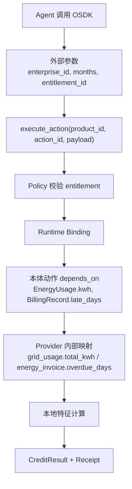

一句话：

```text
OSDK 参数是外部调用合约；depends_on 是 Runtime 内部计算依赖。
```

### 4.5 客户侧 OSDK 与我方沙箱 OSDK

更通用的部署方式是把客户的 OSDK 调用视为一个独立 workload。这个 workload 可以在客户侧运行，也可以在我方独立沙箱运行，但都必须经过可信数据空间网关才能调用 Runtime。

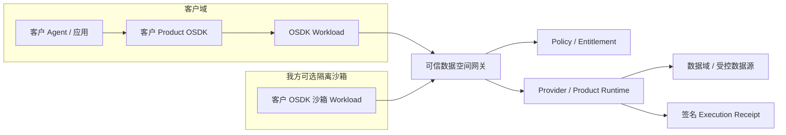

共同约束是：

- OSDK workload 不直连数据库。
- OSDK workload 不直连 Runtime 内网。
- 所有调用经可信数据空间网关。
- 所有调用带签名、授权、合约、路由和审计 envelope。

## 5. 场景设计

当前 Demo 使用两个业务场景和一个运维视图来证明机制。

### 5.1 场景一：企业用电征信可信数据产品

业务问题：

```text
银行希望评估企业经营稳定性，但不应拿走企业逐月用电明细、账单和缴费流水。
```

解决方式：

- 银行 Agent 调用 `EnterpriseEnergyCreditClient.compute_credit_features(...)`。
- 同一产品动作可以进入国家电网 Runtime，也可以进入综合能源 Runtime。
- 两个 Provider 的底层表结构不同，但都映射到统一的 `EnterpriseEnergyCredit` 领域本体。
- Runtime 在数据域内完成特征计算，只返回摘要、评分、解释、质量快照和凭证。

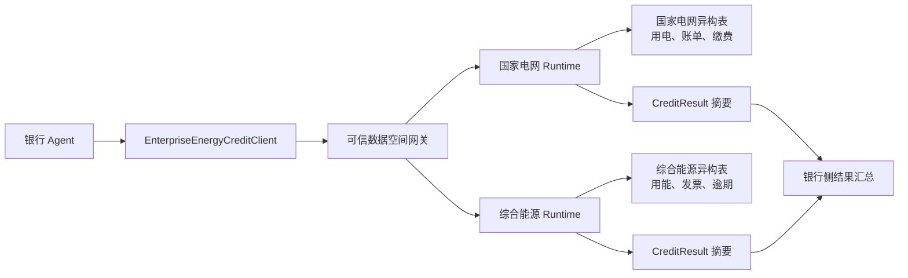

需要特别说明：

```text
用电征信不是把两个地方的原始数据搜索出来再合并。
如果跨 Provider 汇总，汇总的是产品结果或特征摘要，不是原始账单、缴费流水或连接串。
```

### 5.2 场景二：长春城市生命线开挖风险产品

业务问题：

```text
施工方需要评估开挖风险，但管线精确坐标、权属详情和监测细节不能随意输出。
```

解决方式：

- 外部应用只提交工程 ID、开挖范围、深度、施工方式和授权编号。
- Runtime 在数据域内使用管线 GIS、保护规则、监测摘要和历史隐患。
- 返回风险等级、影响资产类型、影响段数、建议、质量摘要和凭证。
- 如果 `PipelineSegment.exact_coordinates` 升级为 `COMPUTE_ONLY`，OSDK 不生成坐标读取接口，但风险评估动作仍可在 Runtime 内部使用坐标计算。

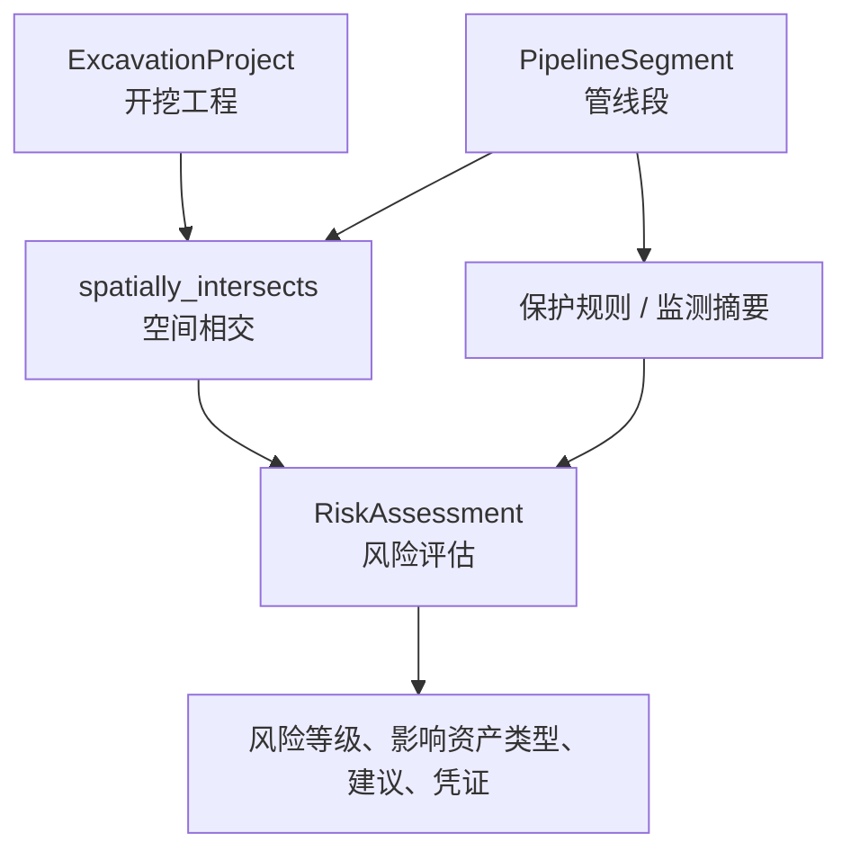

### 5.3 场景三：动态本体运维

业务问题：

```text
如果本体只是图形展示，无法证明它真的约束接口和执行。
```

解决方式：

- 展示全量动态本体。
- 展示产品投影。
- 展示分类分级如何改变编译结果。
- 展示重新编译后 OSDK 接口收缩。
- 展示 Agent 如何读取新 OSDK 并避开已收缩接口。

## 6. 基于架构的 Demo 演示路径

这一节把页面操作和底层架构对应起来，便于讲解时不只是“点按钮”，而是说明每一步解决什么问题。

### 6.1 Demo 开场：先讲目标和问题

建议开场用 1 分钟说明：

```text
我们不是演示一个普通 SDK，而是演示数据产品如何在不暴露原始数据的前提下，被 Agent 发现、授权、调用、适配和验证。
```

然后对应页面顶部的 Agent 价值闭环：

| 页面内容 | 说明 |
| --- | --- |
| 发现 | Agent 读取产品目录和 OSDK/MCP 描述 |
| 授权 | Agent 申请 entitlement，不绕过 Policy |
| 编排 | Agent 调用命名动作，不接触 SQL |
| 适配 | 本体变化后读取新 OSDK |
| 验证 | 验证 Receipt、hash 和签名 |

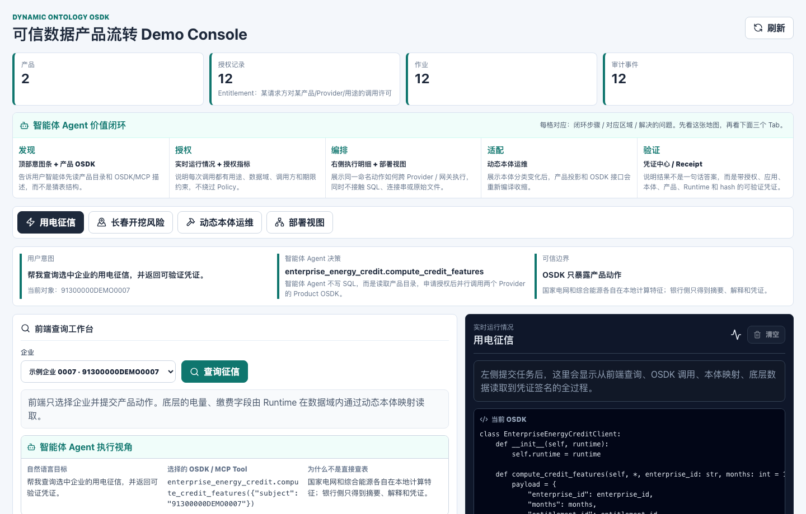

### 6.2 用电征信 Demo：从企业查询到可信结果

页面操作：

1. 进入“用电征信”。
2. 选择企业，例如 `91300000DEMO0007`。
3. 点击“查询征信”。
4. 观察左侧结果、动态本体、底层数据样例。
5. 观察右侧实时执行情况。

架构解释：

| 页面动作 | 架构层 | 发生了什么 |
| --- | --- | --- |
| 选择企业 | 体验层 | 用户只提供业务对象，不写 SQL |
| 查询征信 | OSDK 层 | 调用 `compute_credit_features` 命名动作 |
| 生成/携带授权编号 | Policy 层 | `entitlement_id` 用于校验用途、期限、Provider、调用方 |
| 进入 Provider Runtime | Runtime 层 | 在数据域内读取映射后的本体字段 |
| 返回征信摘要 | 产品结果层 | 外部只得到 `CreditResult` |
| 生成凭证 | Audit 层 | Receipt 写入授权、版本、输入输出 hash 和签名 |

OSDK 调用代码：

```python
result = client.compute_credit_features(
    enterprise_id="91300000DEMO0007",
    months=12,
    entitlement_id="ent_cddf8c7d872e",
)
```

讲解重点：

- `enterprise_id` 和 `months` 是业务参数。
- `entitlement_id` 是授权许可编号。
- `EnergyUsage.kwh`、`BillingRecord.late_days` 是 Runtime 内部依赖，不是外部参数。
- 银行侧不接触原始用电明细或缴费流水。

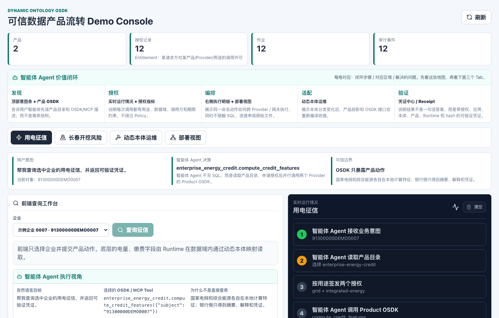

### 6.3 长春开挖风险 Demo：敏感坐标只参与计算不输出

页面操作：

1. 进入“长春开挖风险”。
2. 输入工程 ID、开挖范围、深度、施工方式。
3. 点击“评估风险”。
4. 查看风险等级、影响资产类型、影响段数、建议和凭证。

架构解释：

| 页面动作 | 架构层 | 发生了什么 |
| --- | --- | --- |
| 输入工程参数 | OSDK 层 | 外部只提交开挖工程参数 |
| 评估风险 | Runtime 层 | Runtime 内部做 GIS intersection、buffer、距离和规则评分 |
| 坐标分类升级 | Product Compiler | 坐标读取接口消失，但动作内部依赖保留 |
| 输出结果 | 产品结果层 | 返回风险等级和建议，不返回精确坐标 |

调用代码：

```python
result = client.assess_excavation_risk(
    project_id="cc-demo-2026-001",
    excavation_area=geojson_polygon,
    depth_m=4.5,
    construction_method="mechanical",
    entitlement_id="ent_changchun_demo",
)
```

### 6.4 动态本体运维 Demo：证明本体真的会影响接口

页面操作：

1. 进入“动态本体运维”。
2. 查看全量本体。
3. 查看产品投影。
4. 把管线精确坐标升级为核心数据或 `COMPUTE_ONLY`。
5. 点击重新编译 OSDK。
6. 观察读取接口消失，但风险评估动作保留。

讲解重点：

```text
全量动态本体很大，但 Product OSDK 只暴露产品允许暴露的一小部分。
产品接口不是人工写死的，而是由本体、投影、分类分级和策略共同编译出来的。
```

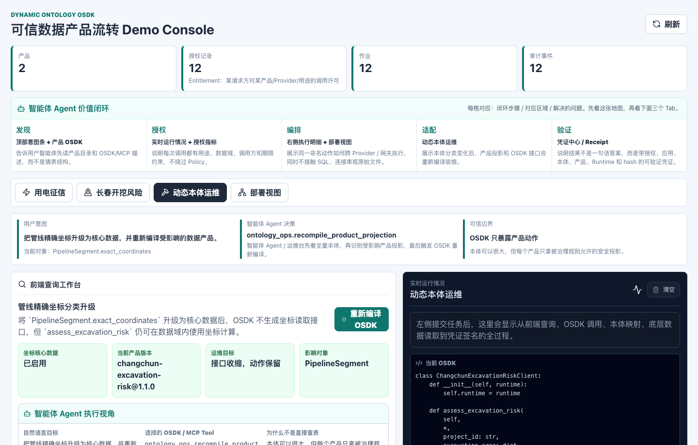

### 6.5 部署视图 Demo：说明 OSDK workload 和可信网关

页面操作：

1. 进入“部署视图”。
2. 切换“客户侧 OSDK Workload”和“我方独立 OSDK 沙箱”。
3. 查看 `GatewayRuntimeAdapter` 代码。
4. 点击“模拟网关调用”。

架构解释：

```python
gateway_runtime = GatewayRuntimeAdapter(
    gateway_url="https://tds-gateway.example.com",
    workload_id="customer-bank-agent",
    workload_attestation="sha256:workload-attestation",
    allowed_products=["enterprise-energy-credit"],
)

client = EnterpriseEnergyCreditClient(runtime=gateway_runtime)

result = client.compute_credit_features(
    enterprise_id="91300000DEMO0007",
    months=12,
    entitlement_id="ent_demo_gateway",
)
```

这里的关键点是：

- OSDK 调用面不变。
- `runtime` 被替换成 `GatewayRuntimeAdapter`。
- 调用先进入可信数据空间网关。
- 网关再完成身份、签名、授权、路由和审计。
- Runtime 仍在受控数据域内实际计算。

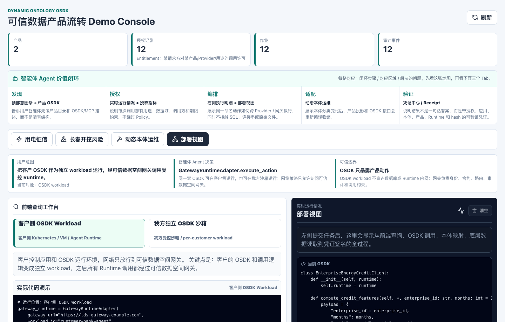

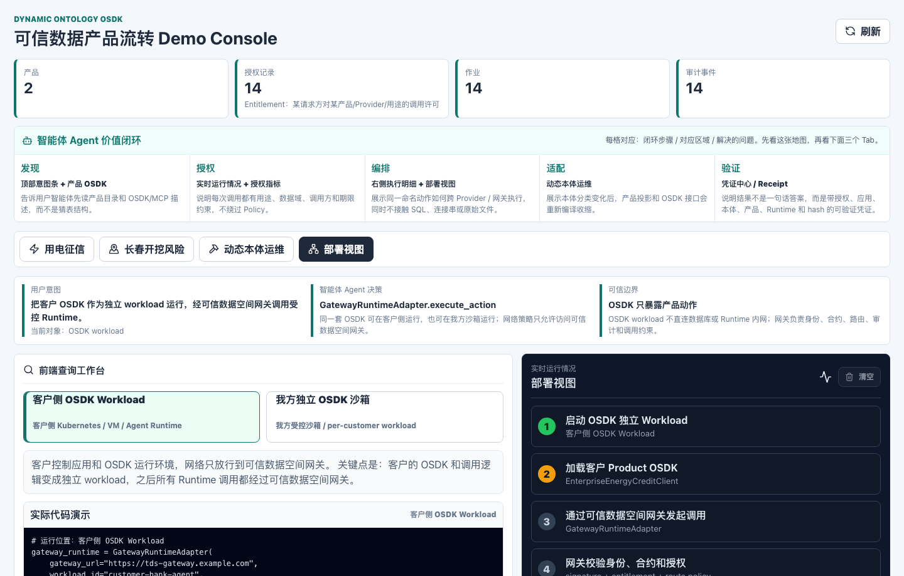

## 7. Execution Receipt 如何解释

Receipt 是执行凭证，不是普通日志。它要回答：

```text
这个结果是谁请求的？
为了什么用途？
基于哪个授权？
哪个应用包发起？
使用哪个本体、映射、产品和 Runtime 版本？
输入输出是否被篡改？
策略是否允许？
谁签名背书？
```

示例结构：

```json
{
  "request_id": "req_20260716_0001",
  "purpose": "credit_assessment",
  "requester_agent": "bank-credit-agent",
  "provider_agent": "grid-runtime",
  "data_subject": "91300000DEMO0007",
  "entitlement_id": "ent_cddf8c7d872e",
  "application_digest": "sha256:...",
  "ontology_version": "doir-v0.2.3",
  "mapping_version": "grid-map-v0.4.1",
  "product_version": "enterprise-energy-credit-v0.2.0",
  "runtime_version": "grid-runtime-v0.3.0",
  "input_hash": "sha256:...",
  "output_hash": "sha256:...",
  "policy_decision": "allow",
  "previous_event_hash": "sha256:...",
  "provider_signature": "ed25519:..."
}
```

验证方不需要看到原始数据，只需要验证：

- 签名是否正确。
- 输入输出 hash 是否匹配。
- hash 链是否连续。
- 授权、产品、本体和 Runtime 版本是否符合声明。

## 8. 实施门槛评估

OSDK 本身确实不是最难的部分。真正难的是让 OSDK 调用可信、可控、可演进、可运营。

### 8.1 难度较低的部分

| 模块 | 难度 | 原因 |
| --- | --- | --- |
| Python OSDK 生成 | 低 | 根据产品 schema 生成 Client、参数模型和返回模型 |
| TypeScript OSDK 生成 | 低到中 | 主要处理包发布、前端类型和版本兼容 |
| MCP Tool / OpenAPI 生成 | 低到中 | 从产品动作和 schema 生成机器可读工具描述 |
| 参数校验 | 低到中 | 可依赖 Pydantic、JSON Schema、OpenAPI |

### 8.2 真正困难的部分

| 模块 | 难度 | 原因 |
| --- | --- | --- |
| 动态本体建模与治理 | 中到高 | 要表达对象、字段、关系、动作、分类分级、质量规则和版本演进 |
| Product Compiler | 中到高 | 要保证禁止字段不会进入接口、结果模型或间接泄漏路径 |
| Runtime Binding | 高 | 要把本体动作稳定映射到异构表、GIS、API、文件和流数据 |
| Policy / Entitlement | 高 | 要覆盖用途、主体、Provider、期限、配额、撤销和输出粒度 |
| 可信数据空间网关 | 高 | 要做身份、签名、路由、合约、审计、限流、租户隔离和跨域安全 |
| OSDK workload 隔离 | 高 | 客户侧或我方沙箱都需要网络策略、镜像证明、密钥管理和运行审计 |
| Execution Receipt | 中到高 | 要让 hash、签名、版本、授权、策略决策可验证且防篡改 |
| 联合计算扩展 | 很高 | 多 Runtime 编排、联邦聚合、隐私计算、TEE/MPC 会引入复杂协议和运维要求 |

一句话：

```text
OSDK 是易用入口，不是可信边界。
可信边界在 Runtime、Policy、Gateway、Sandbox 和 Receipt 这一整套系统里。
```

## 9. 对外表达建议

不要把卖点说成：

```text
我们生成了一个 SDK。
```

建议表达为：

```text
我们把动态本体治理后的数据能力编译成可被 Agent 调用的数据产品接口。
客户或 Agent 像调用普通 SDK 一样调用产品动作；
但这个 SDK 不能越权、不能查原始表、不能绕过授权。
实际计算在受控 Runtime 内完成，每次结果都有可验证凭证。
```

更短的客户版：

```text
像调 SDK 一样调数据产品；
像走数据空间一样受控流转；
像验签一样验证结果可信。
```

## 附录 A：当前 Demo 截图

### A.1 Agent 价值闭环与用电征信工作台


### A.2 用电征信执行链路


### A.3 动态本体运维


### A.4 部署拓扑和代码


### A.5 网关执行链路


## 附录 B：术语表

| 术语 | 说明 |
| --- | --- |
| DOIR | Dynamic Ontology Intermediate Representation，动态本体中间表示 |
| Product Projection | 从全量本体中选择某个产品需要暴露的对象、字段、关系和动作 |
| Product Compiler | 根据产品投影、用途、分类分级、质量门槛和 Runtime 能力生成产品发布包 |
| Product OSDK | 面向开发者和 Agent 的受控 SDK，只暴露命名 Query/Action |
| MCP Tool | 面向 Agent 的机器可读工具描述，使 Agent 能发现和调用产品能力 |
| Runtime Binding | 把产品动作和本体依赖绑定到底层数据域执行能力 |
| Entitlement | 授权许可，描述谁为了什么用途在什么范围内可以调用哪个产品 |
| Trusted Data Space Gateway | 可信数据空间网关，负责身份、签名、合约、路由、审计和跨域边界 |
| Execution Receipt | 执行凭证，证明一次结果基于指定授权、应用、本体、产品和 Runtime 产生 |

