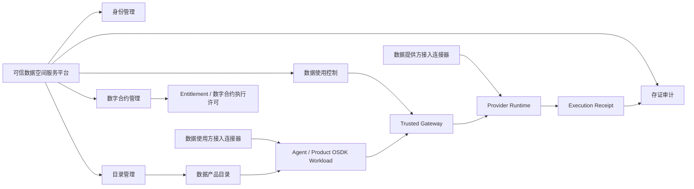
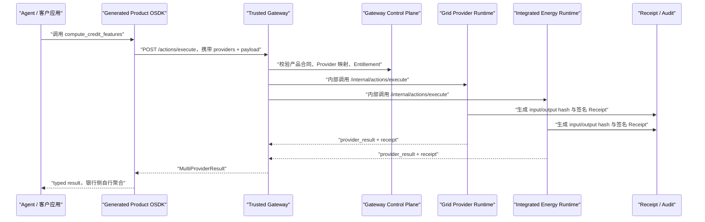
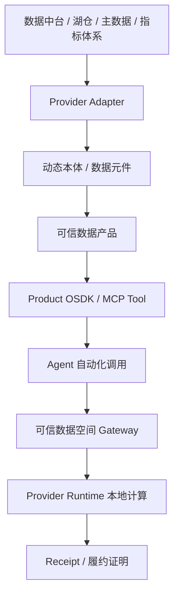
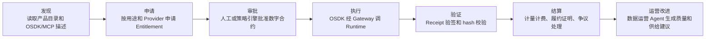

# 利用 OSDK 实现面向智能体自动化数据交易的可信数据空间创新可行性报告

**日期：2026-07-19**

## 1. 结论先行

当前 Demo 与“可信数据空间”“数据元件”“数据产品”没有方向冲突，反而可以作为可信数据空间中“数据服务化、智能体自动调用、履约可验证”的执行层增强。

更准确地说：

- 可信数据空间标准解决的是跨主体数据流通利用的基础设施框架：身份、连接器、目录、数字合约、使用控制、存证审计。
- 数据元件解决的是把原始数据加工成边界清晰、可复用、可流通的中间形态，介于原始数据资源和最终数据产品之间。
- 当前 OSDK Demo 解决的是：当数据产品从“表/文件/API”进一步变成“可执行业务动作”时，Agent 如何发现、申请、调用、跨 Provider 编排并验证执行凭证。

因此，本方案不是替代可信数据空间，也不是替代数据中台，而是可以嵌入可信数据空间和数据中台之上，成为 **面向 Agent 的可信数据产品执行与自动交易层**。

可行性判断：

1. **理论路线可行**：Apheris Gateway、Eclipse Dataspace Components、Ocean Compute-to-Data、AWS Clean Rooms、国内可信数据空间与隐私计算平台都已分别验证“数据不出域、合约控制、本地计算、多方协作、可审计”这些基础路线。
2. **当前 Demo 已验证关键闭环**：动态本体/产品投影编译、typed OSDK 生成、远程 OSDK 经 Gateway 调 Provider Runtime、多 Provider fan-out、逐 Provider Receipt、授权撤销和部分失败处理。
3. **后续主要是工程复杂度与合规安全强化**：真实数据源 adapter、持久化 Registry/Policy/Audit、强身份、密钥管理、沙箱/TEE/MPC、DSP/ODRL 兼容、交易计量计费、生产运维等。
4. **仍不能说“无风险”**：隐私泄露、推断攻击、运行时绕过、跨主体责任、审计采信、监管认可都不是 OSDK 自身能解决的，需要生产级可信数据空间工程体系承接。但这些不是“理论方向不可实现”，而是明确可分解的工程、安全和合规任务。

建议继续推进，产品定位应从“我们也做可信数据空间”调整为：

> 在可信数据空间中，为数据提供方和数据使用方提供一套面向 Agent 的数据产品自动交易与可信执行框架：把数据元件/数据产品编译成 Agent 可调用的 Product OSDK，所有调用经数字合约和 Gateway 控制，在 Provider Runtime 内完成计算，并返回可验证 Receipt。

## 2. 资料来源与取证说明

本报告参考以下资料：

- 百度百科“数据元件”：https://baike.baidu.com/item/%E6%95%B0%E6%8D%AE%E5%85%83%E4%BB%B6/58069761  
  说明：该页面在命令行抓取时返回百度安全验证，未能直接抽取正文。因此本报告将其作为“数据元件”概念入口，同时以国家数据基础设施、可信数据空间技术架构及公开产业资料作为主要可复核依据。
- 附件《可信数据空间 技术架构》，全国数据标准化技术委员会技术文件 `TC609-6-2025-01`，2025-04-30 发布。附件文件名：`ff808081-960ee580-0196-8636bb64-04ce.pdf`。官方同名 PDF URL 可按文件名访问国家数据局站点：  
  https://www.nda.gov.cn/sjj/ywpd/szkjyjcss/0430/ff808081-960ee580-0196-8636bb64-04ce.pdf
- 国家数据局《可信数据空间发展行动计划（2024-2028年）》：  
  https://www.nda.gov.cn/sjj/zwgk/zcfb/1122/20241122164142182915964_pc.html
- 国家数据局“中小微企业融资增信可信数据空间”公开案例：  
  https://www.nda.gov.cn/sjj/ywpd/sjzy/0121/20260121135536476611581_pc.html
- Palantir Ontology SDK / OSDK：  
  https://www.palantir.com/docs/foundry/ontology-sdk/overview
- Eclipse Dataspace Components：  
  https://projects.eclipse.org/projects/technology.edc
- Eclipse Dataspace Protocol：  
  https://projects.eclipse.org/projects/technology.dataspace-protocol-base/governance
- International Data Spaces Connector：  
  https://international-data-spaces-association.github.io/DataspaceConnector/Introduction
- Apheris Gateway：  
  https://www.apheris.com/docs/gateway/latest/general/introduction.html  
  https://www.apheris.com/docs/gateway/latest/general/architecture.html
- AWS Clean Rooms：  
  https://docs.aws.amazon.com/clean-rooms/latest/userguide/what-is.html
- Snowflake Data Clean Rooms：  
  https://docs.snowflake.com/en/user-guide/cleanrooms/about
- Databricks Clean Rooms：  
  https://docs.databricks.com/aws/en/clean-rooms/
- Decentriq Data Clean Rooms：https://www.decentriq.com/data-clean-rooms
- Ocean Protocol Compute-to-Data：  
  https://docs.oceanprotocol.com/developers/compute-to-data
- Dawex 数据交换和数据空间平台：  
  https://www.dawex.com/en/data-exchange-technology/interoperability/
- Dawex Data Exchange Solution：https://www.dawex.com/en/data-exchange-solution/
- SecretFlow 隐语：  
  https://www.secretflow.org.cn/
- 隐语可信数据空间介绍：https://www.secretflow.org.cn/zh-CN/docs/feature-exp/latest/yaipurge93fgr7n8
- 华为云数据空间、数据交换相关产品入口：  
  https://www.huaweicloud.com/product/
- 华为云 Stack AI 可信数据空间解决方案：https://www.huaweicloud.com/product/huaweicloudstack/data-ai-space.html
- 华为云可信智能计算服务 TICS：https://www.huaweicloud.com/product/tics/data-flow-solution.html
- 中国电子云数据要素、数据空间相关产品入口：  
  https://www.cecloud.com/
- 中国电子云可信数据空间方案公开资料：https://cecloud.com/news/7350769509092823040.html
- 阿里云 DataWorks 数据开发治理平台：https://www.alibabacloud.com/product/dataworks

当前 Demo 代码依据：

- `core/trusted_data_demo/gateway_app.py`
- `core/trusted_data_demo/gateway.py`
- `core/trusted_data_demo/provider_app.py`
- `core/trusted_data_demo/control_plane.py`
- `core/trusted_data_demo/runtime.py`
- `core/trusted_data_demo/osdk_generator.py`
- `generated/python/enterprise_energy_credit/enterprise_energy_credit/client.py`
- `generated/python/enterprise_energy_credit/enterprise_energy_credit/runtime.py`
- `docs/project-status-and-osdk.md`
- `docs/research/2026-07-17-data-service-landscape-and-novelty.md`

## 3. 标准语境：可信数据空间到底要求什么

附件《可信数据空间 技术架构》给出的核心定义可以概括为：

可信数据空间是基于共识规则联接多方主体、实现数据资源共享共用的数据流通利用基础设施，是数据要素价值共创的应用生态。

它的关键词不是“把数据搬到一个平台”，而是：

- **共识规则**：参与主体对数据内容、使用方式、使用次数、使用范围、使用环境等达成约定。
- **数字合约**：以数字化形式描述各方对数据流通和使用的承诺。
- **使用控制**：在传输、存储、使用和销毁环节，用技术手段保证数据使用符合合约。
- **服务平台 + 接入连接器**：服务平台负责身份、目录、合约、空间管理、使用控制、审计；接入连接器是各参与方加入空间和执行使用控制的载体。
- **数据产品为基本单元**：可信数据空间中的流通对象是数据产品，形式可以是数据库表、文件或数据 API。
- **数据服务方可加入**：算力服务、人工智能服务、数据治理服务、隐私保护计算服务、数据交易服务等都可以通过连接器接入。

标准文件中对可信数据空间服务平台提出 7 类核心能力：

1. 身份管理
2. 接入连接器管理
3. 目录管理
4. 数字合约管理
5. 可信数据空间管理
6. 数据使用控制
7. 国际空间互通网关

同时，安全要求包括数字合约完整性、合约真实性、数据安全分级、数据传输安全、数据存储安全、数据计算安全、日志存证和合规审计。

这说明可信数据空间不是单一技术产品，而是一个包含平台、连接器、合约、策略、运行环境、审计和生态角色的系统工程。

## 4. 数据元件与当前方案的关系

“数据元件”在产业语境中通常指向这样一种中间形态：

- 来源于原始数据资源。
- 经过清洗、治理、加工、标注、标准化、脱敏或融合。
- 形成边界清晰、语义明确、可复用、可组合、可流通的中间单元。
- 可进一步封装为具体数据产品或数据服务。

它解决的是“原始数据资源不能直接高效流通，最终数据产品又太场景化”的中间层问题。

当前 OSDK Demo 里的 DOIR、动态本体、产品投影和 Provider mapping，可以被理解为数据元件机制的一个“可执行语义版本”：

| 数据元件概念 | 当前 Demo 对应物 | 说明 |
| --- | --- | --- |
| 原始数据资源 | Provider 侧用电、账单、管线、监测 fixture | 当前为合成数据；生产中应替换为真实表、GIS、API |
| 加工治理规则 | DOIR L0/L1/L2 mapping、分类分级、质量规则 | 决定字段语义、敏感级别和可用方式 |
| 数据元件 | 动态本体对象、属性、Link、Query、Action | 不是单纯表字段，而是具备业务语义的可组合单元 |
| 数据产品 | ProductProjection / Product Manifest | 面向用途封装的可申请、可授权、可执行产品 |
| 数据产品接口 | Generated Product OSDK / MCP Tool / OpenAPI | Agent 和应用调用的稳定入口 |
| 数据使用证明 | ExecutionReceipt | 证明谁、基于什么合约、调用了什么版本、得到什么 hash |

因此，本方案可以利用“数据元件”概念，但不应把数据元件仅理解为“物化宽表”或“加工后数据包”。更有价值的表达是：

> 动态本体中的对象、属性、关系和动作，是面向 Agent 可执行的数据元件；Product OSDK 是把这些数据元件封装为可交易、可授权、可调用的数据产品接口。

## 5. 当前方案与可信数据空间标准的映射

映射关系如下：

| 可信数据空间标准组件 | 当前 Demo 已实现/可承接部分 | 当前缺口 |
| --- | --- | --- |
| 服务平台 | `GatewayControlPlane`、产品目录、Entitlement 创建 | 缺少统一身份、连接器注册、空间管理、合约协商、计量计费 |
| 接入连接器 | `Provider Runtime` 可视为提供方连接器中的使用控制/计算执行模块 | 缺少标准连接器协议、Connector 注册、运行监测、能力适配 |
| 数字合约 | Entitlement 表达产品、用途、Provider、期限、配额、输出粒度 | 缺少正式电子签名、合同协商、ODRL/DSP 策略映射 |
| 使用控制 | Gateway preflight、Runtime consume、撤销后拒绝、输出过滤 | 缺少细粒度策略语言、持续控制、异常终止、查询预算 |
| 数据产品 | Product Manifest、Product Schema、Generated OSDK | 缺少国家/行业目录登记、产品唯一标识、价格、权益分配 |
| 数据计算环境 | Provider Runtime 本地执行产品动作 | 缺少沙箱、TEE/MPC、资源隔离、远程证明、真实数据源权限隔离 |
| 履约证明 | ExecutionReceipt、input/output hash、Ed25519 签名 | 缺少持久化、公钥体系、时间戳、第三方存证、监管采信 |
| 数据服务方 | Agent、OSDK Compiler、Gateway 可作为数据服务能力 | 缺少服务方接入、服务目录、SLA、运营流程 |

判断：当前 Demo 与可信数据空间标准是兼容关系。它实现的是标准中“数据产品安全计算、使用控制、履约证明、数据服务方能力”的一段关键执行链，而不是完整可信数据空间服务平台。

## 6. 是否存在冲突

不存在根本冲突，但有 4 个边界需要在产品叙事和后续工程中处理清楚。

### 6.1 OSDK 不是连接器标准的替代

可信数据空间标准强调接入连接器及其接口。OSDK 是应用/Agent 调用数据产品的开发接口，不应被表述为替代连接器。

更合理的定位是：

- Provider Runtime 是连接器内部或连接器旁路的受控执行环境。
- Gateway 是服务平台或空间内可信路由/使用控制模块。
- Product OSDK 是数据使用方连接器或 Agent workload 调用数据产品的 client SDK。

### 6.2 Entitlement 不是完整数字合约

当前 Entitlement 已包含产品、用途、Provider、期限、配额、输出粒度，但它不是正式数字合约。

生产中需要：

- 合同协商流程。
- 合同双方电子签名。
- 合同防篡改存储。
- ODRL 或等价策略语言。
- 合同解除、撤销、备案。
- 合同和执行凭证的关联。

### 6.3 Receipt 不是完整存证审计系统

当前 Receipt 可以证明单次调用的输入输出 hash 和 Provider 签名，但还不是可信数据空间要求的完整日志存证与合规审计。

生产中需要：

- Provider 长期身份和公钥管理。
- KMS/HSM 或等价密钥保护。
- 防篡改事件存储。
- 时间戳服务。
- 跨重启可验证。
- 审计查询和监管报送接口。

### 6.4 字段不暴露不等于隐私安全

当前 Demo 的分级编译可以让原始字段不出现在 OSDK 和输出结果里，但隐私泄露还可能来自推断攻击、重复查询、低样本聚合、模型反演等。

生产中应按场景引入：

- 最小群体阈值。
- 查询预算。
- 结果扰动或差分隐私。
- 输出审核。
- TEE、MPC、联邦学习、密态计算或数据沙箱。

## 7. 当前 Demo 已验证的技术闭环

当前最新代码已验证以下路径：

已验证能力：

1. **动态本体到产品合同**：DOIR、字段分级、产品投影编译为 Product Manifest、Schema、MCP/OpenAPI 和 Python OSDK。
2. **OSDK 远程调用**：生成的 SDK 不依赖内部 Runtime，而是经 `ProviderRuntimeClient` 调 Gateway。
3. **多 Provider fan-out**：一次 OSDK 调用携带多个 Provider binding，Gateway 并发调用多个 Runtime。
4. **Gateway 不持有数据**：Gateway 只做身份、合同、授权、路由和响应关联。
5. **Provider Runtime 本地计算**：每个 Runtime 只处理自身 provider scope。
6. **授权控制**：Entitlement 支持用途、期限、Provider、配额、撤销。
7. **输出边界**：产品结果不返回原始用电明细、缴费流水、管线精确坐标等敏感数据。
8. **执行凭证**：Provider 返回带 input/output hash、产品版本、Runtime 版本和 Ed25519 签名的 Receipt。
9. **部分失败**：某 Provider 不可用时，Gateway 返回 `partial`，成功 Provider 的结果和凭证保留。

## 8. Demo 场景分析：问题、解决方式与价值

当前 Demo 不是一个单场景页面，而是用四类场景证明同一套机制的不同价值面：用电征信证明多 Provider 数据产品交易，长春开挖证明敏感空间数据可用不可见，动态本体运维证明分类分级驱动接口变化，远程 OSDK 部署证明客户侧 Agent workload 可以通过可信网关访问 Provider Runtime。

### 8.1 企业用电征信可信数据产品

业务问题：

- 银行需要更多非传统征信特征判断中小企业经营稳定性，例如用电覆盖月数、用电波动、缴费逾期区间。
- 国家电网、综合能源等 Provider 的底层数据结构不同，银行不应逐个对接表结构和接口。
- 用电明细、缴费流水、客户名称等可能涉及敏感经营信息，Provider 不愿输出原始数据。
- 银行需要知道结果来自哪个 Provider、基于什么授权、哪一版产品和 Runtime 执行，方便审计和风控解释。

当前 Demo 的解决方式：

- 将两个异构 Provider 映射到统一的 `enterprise-energy-credit` 产品合同。
- 生成 `EnterpriseEnergyCreditClient`，银行侧只调用 `compute_credit_features`。
- OSDK 请求中携带多个 `ProviderBinding(provider_id, entitlement_id)`，不携带 Provider Runtime 地址。
- Gateway 对每个 Provider 分别校验 Entitlement，并 fan-out 到 `grid-runtime` 和 `integrated-energy-runtime`。
- Provider Runtime 在本地计算用电稳定性、覆盖月数、逾期区间、质量摘要和信用特征，不返回原始用电/缴费明细。
- Gateway 返回逐 Provider 的结果和 Receipt，银行应用在自己侧决定权重、最低来源数、缺失来源降级和最终评分。

价值：

- 证明“同一个数据产品动作可以跨多个异构数据域执行”。
- 把银行应用从“对接多个 Provider API/表结构”降为“调用一个 typed OSDK 方法”。
- Gateway 不获取银行最终风控模型，Provider 不输出原始数据，双方边界清晰。
- Receipt 让数据交易从“拿到一个分数”升级为“拿到可验证的履约证据”。

当前存在的问题：

- 数据仍是合成 fixture，没有连接真实电力、账单或缴费系统。
- Provider mapping 目前主要证明字段绑定和语义映射，还没有驱动真实 SQL/DuckDB/API 查询。
- Entitlement、Policy、Audit 仍是内存态，不具备跨重启、跨实例和并发一致性。
- 信用特征计算是 Demo 规则，不是银行生产风控模型，也没有坏账标签验证。
- 隐私保护目前主要依靠输出裁剪，没有实现重复查询预算、最小样本阈值或推断泄露防护。

后续改进：

- 两个 Provider 分别接入不同物理 schema 的 SQLite/DuckDB 或真实 API，证明异构接入。
- 增加 Provider conformance test，校验同一产品合同下各 Provider 输出结构、质量指标和时间窗口径一致。
- 将 Entitlement、Receipt、产品版本和 Provider 公钥持久化。
- 增加银行侧示例 Agent：自动发现产品、申请授权、调用两个 Provider、处理 partial、验签 Receipt、输出风控解释。
- 增加计量计费事件，把每次 Provider 成功调用与交易结算挂钩。

### 8.2 长春城市生命线开挖风险产品

业务问题：

- 城市管线精确坐标、拓扑和资产标识通常属于高敏感或核心数据，但施工方需要知道开挖风险。
- 传统数据交付方式要么泄露精确坐标，要么只能给静态审批结论，难以支撑 Agent 自动化规划和多次方案评估。
- 分类分级一旦变化，应用接口也应同步收缩，否则历史 API 很容易继续暴露敏感能力。

当前 Demo 的解决方式：

- 将 `PipelineSegment`、`ExcavationProject`、`RiskAssessment` 等对象组织为长春场景动态本体。
- 产品动作 `assess_excavation_risk` 接收开挖范围、深度、施工方式、项目 ID。
- Runtime 在数据域内使用管线几何、保护规则、历史隐患和监测摘要进行相交、缓冲、距离与规则评分。
- 输出只包含风险等级、影响资产类型、影响段数、建议和质量摘要，不输出精确坐标、管段 ID 或完整拓扑。
- 动态本体运维中演示“管线精确坐标升级为核心数据”后重新编译，坐标读取接口消失，但风险评估动作仍可在 Provider 域内使用坐标计算。

价值：

- 证明“数据可用不可见”不只适用于表格，也适用于 GIS 和城市治理数据。
- 证明分类分级不是写在 PPT 里的制度，而是可以进入编译器，直接改变 OSDK 暴露面。
- 让施工方 Agent 可以自动评估多个施工方案，而不直接持有核心管线坐标。
- 给城市生命线、交通、能源、水务等场景提供可复用的数据服务产品模式。

当前存在的问题：

- GIS 计算是简化实现，未接 PostGIS、GeoPackage、坐标系转换或真实空间索引。
- 重复小范围查询可能反推出管线位置，当前尚无空间隐私预算、最小面积约束或模糊化策略。
- 风险规则仍是 Demo 规则，缺少专家审批、规则版本、事故样本校验和责任边界。
- 施工项目审批、监管角色、现场反馈闭环没有完整实现。

后续改进：

- 接入 GeoPackage/PostGIS adapter，支持真实坐标系、空间索引和拓扑质量检查。
- 加入空间隐私控制：最小查询面积、查询频率限制、结果泛化、风险网格化、敏感区域二次审批。
- 将规则集版本写入 Product Manifest 和 Receipt，支持事后追责。
- 增加施工方 Agent 和监管方 Agent：前者生成方案并申请评估，后者审批高风险调用和留存履约证明。

### 8.3 动态本体运维与数据产品编译

业务问题：

- 传统数据目录或数据中台 API 往往是静态接口，字段分级、语义口径、产品范围变化后，很难自动反映到 SDK 和 Agent 工具面。
- Provider 数据结构会变化，应用接口也会演进，如果没有本体版本和兼容性判断，数据产品很容易变成一次性定制项目。
- Agent 需要机器可读的能力描述，否则只能靠提示词猜接口、猜字段、猜约束。

当前 Demo 的解决方式：

- 用 DOIR 描述 SourceDataset、ObjectType、PropertyType、LinkType、ActionType、ProductProjection、RuntimeBinding。
- Product Compiler 从 DOIR、字段分级和产品定义生成 Product Manifest、Schema、MCP Tool、OpenAPI 和 Python OSDK。
- OSDK Generator 根据 action input schema 生成 typed 方法签名、Pydantic 输入输出模型和 Provider Runtime Client。
- 运维视图演示分类分级变化后重新编译，接口暴露面同步收缩。

价值：

- 把“数据治理结果”变成“可执行的软件合同”，而不是停留在目录和字段标签。
- Agent 可以读取 OSDK/MCP 描述，知道能调用什么、需要什么授权、会返回什么。
- Provider 接入新数据源时，只要通过 conformance test，就能复用已有产品动作和应用。
- 为数据运营 Agent 提供工作对象：本体映射、质量报告、兼容性报告、产品发布包、变更影响分析。

当前存在的问题：

- Registry 仍是 Lite 版本，未实现生产级 diff、审批、回滚、发布历史和变更影响图。
- DOIR 仍主要由 fixture seed 生成，不是从真实数据平台、文档和人工标注流程中持续维护。
- 编译器已从 hardcode 进步到 schema-driven，但类型系统、错误模型、语义版本规则还不完整。
- 前端运维视图是演示态，不是完整的本体建模和产品发布工作台。

后续改进：

- 建立持久化 DOIR Registry，加入版本树、breaking change 规则、审批流和发布流水线。
- 建设 Provider mapping IDE 或低代码映射台，支持从数据中台、数据库、API、文档自动生成候选映射。
- 增加 OSDK artifact 签名和包仓库发布，确保 Agent 使用的是被批准的产品版本。
- 增加数据运营 Agent：自动发现字段漂移、质量下降、映射失败和产品兼容性风险。

### 8.4 远程 OSDK、可信网关与 Provider Runtime fan-out

业务问题：

- 客户可能要求 OSDK 在客户侧运行，也可能接受在我方沙箱运行，但两种情况下都不应直连 Provider 内网和数据库。
- 如果一个业务产品需要多个 Provider，客户不应分别维护每个 Provider 的地址、身份、错误处理和凭证格式。
- 数据空间未来可能接入联邦计算、隐私计算和多 Runtime 编排，需要一个清晰的信任边界。

当前 Demo 的解决方式：

- 生成的 `ProviderRuntimeClient` 只调用 Gateway 的 `/actions/execute`。
- Gateway 使用逻辑 Provider ID 和 Provider route，将请求 fan-out 到多个独立 Provider Runtime。
- Provider Runtime 只接受 Gateway 内部调用，校验 `provider_id`、产品版本、用途、policy decision 和内部凭据。
- OSDK 返回 `MultiProviderResult`，保留每个 Provider 的 `succeeded`、`denied`、`failed`、结果和 Receipt。
- 当前 Docker Compose 已描述 `gateway`、`grid-runtime`、`integrated-energy-runtime`、`changchun-runtime`、`legacy-demo`、`demo-console` 的拆分拓扑。

价值：

- 证明客户侧 Agent workload、我方沙箱 workload、Provider Runtime 可以解耦部署。
- Gateway 成为可信数据空间中的策略执行点和路由点，而不是数据计算点。
- partial 语义使多 Provider 产品更接近真实生产网络：一个 Provider 故障不会抹掉其他 Provider 的履约结果。
- 为后续 TEE、MPC、联邦分析和跨空间互通保留扩展点。

当前存在的问题：

- API key 和内部 Gateway key 是开发共享密钥，不是生产身份体系。
- fan-out 使用同步 HTTP 和线程池，不适合长任务、高并发或需要人工审批的异步交易。
- Provider route 来自配置，不是注册发现、健康路由或跨空间目录解析。
- 没有 request idempotency、配额 reservation/commit、重试补偿和完整 observability。

后续改进：

- 引入 OIDC/mTLS workload identity、Provider 证书和密钥轮换。
- 将 `/actions/execute` 扩展为异步 Job API，支持排队、回调、事件通知和人工审批。
- 建设 Provider Registry 和健康探测，支持动态路由、灰度和故障隔离。
- 增加 OpenTelemetry trace、结构化审计日志和交易计量事件。

## 9. 当前 Demo 的技术验证完整度

| 能力域 | 当前完整度 | 说明 |
| --- | --- | --- |
| 概念验证 | 高 | 已从页面叙事推进到可运行代码闭环 |
| OSDK 生成 | 中高 | typed Python SDK、ProviderBinding、多 Provider result 已实现 |
| Gateway fan-out | 中高 | HTTP 拆分、并发、部分失败、Provider routing 已实现 |
| Provider Runtime | 中 | 有本地计算与输出控制，但数据源仍是 fixture |
| Policy / Entitlement | 中 | 语义正确但内存态，缺少合同生命周期和强策略语言 |
| Receipt | 中 | 签名和 hash 成立，但密钥、存储、时间戳、监管接口仍是演示级 |
| 动态本体 Registry | 中低 | 有 Lite Registry 和编译输入，但不是生产 registry |
| 真实数据接入 | 低 | 未接真实 SQL/GIS/API 数据源 |
| 可信运行环境 | 低 | 未实现沙箱、TEE、MPC、远程证明、资源隔离 |
| 数据交易运营 | 低 | 缺少目录登记、价格、结算、合同协商、履约争议处理 |
| Agent 自动化 | 中 | OSDK/MCP 调用链成立，但 Agent 规划、审批、人机协同和异步通知未完整产品化 |

整体判断：

> 当前 Demo 已完整验证“Agent 通过 OSDK 自动调用可信数据产品”的主技术链路，但尚未完整验证“生产可信数据空间”的身份、合约、连接器、数据源、安全计算、存证审计和交易运营体系。

## 10. 与数据中台的区别和协同关系

传统数据中台通常以企业内部数据治理为中心：采集、湖仓、建模、指标、标签、API、报表。它更擅长解决“企业内部如何管好和复用数据”。

可信数据空间和本方案关注的是跨主体流通：不同组织之间如何在不完全互信的情况下完成数据产品申请、授权、使用控制、执行和审计。

二者不是替代关系：

关系判断：

- 数据中台可以是 Provider 侧的数据底座。
- 动态本体可以把中台中的表、指标、标签、文档、GIS、API 映射成数据元件。
- Product Compiler 可以把数据元件封装成可信数据产品。
- OSDK 可以让 Agent 和业务应用以稳定动作调用数据产品。
- Gateway/Runtime/Receipt 可以保证调用符合合约并留下履约证明。

因此，本方案不是“再做一个数据中台”，而是让数据中台中已经治理好的数据能力，进入跨组织、可授权、可审计、Agent 可自动调用的数据交易网络。

## 11. 类似公司与方案对标：竞争性与互补性

对标结论需要分层：有些方案与我们直接竞争，有些是应当兼容的基础设施，有些是可嵌入 Runtime 的隐私计算能力。不能把所有相邻方案都叫竞品，否则产品边界会发散；也不能忽视它们，因为客户可能已经采购或正在建设这些平台。

### 11.1 竞争性总览

| 方案类别 | 代表方案 | 与我们是否竞争 | 竞争强度 | 推荐策略 |
| --- | --- | --- | --- | --- |
| 联邦计算 / 数据留域 Gateway | Apheris Gateway、Ocean Compute-to-Data | 是，尤其在“计算到数据侧执行”上直接重合 | 高 | 不争“数据不出域”首创，突出动态本体产品合同、typed OSDK、Agent 自动交易和逐 Provider Receipt |
| 数据空间 Connector / 标准基础设施 | Eclipse Dataspace Components、IDS Connector、Dataspace Protocol | 如果我们做完整 Connector 平台则竞争；若只做 OSDK 执行层则互补 | 中 | 兼容 DSP/ODRL，把自己定位为数据空间内的可执行数据产品层 |
| 数据交易 / 数据空间运营平台 | Dawex、国内数据交易所技术平台 | 在目录、合约、交易、结算上竞争；在服务型数据产品执行上互补 | 中高 | 避免重做市场和交易门户，优先提供 Agent/OSDK 执行、履约证明和 Provider conformance |
| Clean Room | AWS、Snowflake、Databricks、Decentriq | 在多方受控分析上竞争；在异构 Provider 与业务 OSDK 上差异明显 | 中 | 强调跨平台、跨组织、业务动作、来源保留，而不是平台内 SQL/Notebook 分析 |
| Ontology SDK / 企业语义层 | Palantir Foundry OSDK | 在“Ontology 到 typed SDK”上强竞争 | 高 | 定位为开放、多 Provider、可信数据空间兼容，不绑定单一 Foundry 平台 |
| 隐私计算平台 | SecretFlow 隐语、华为云 TICS 等 | 若我们宣称隐私计算平台则竞争；作为 Runtime 能力则互补 | 中 | 把它们作为 Provider Runtime 内部计算插件，不重复造 MPC/TEE/FL |
| 数据中台 / 云数据平台 | 华为云、中国电子云、阿里云、传统数据中台厂商 | 在数据治理、目录、API 服务上竞争；在跨主体 Agent 交易层上互补 | 中 | 将数据中台视为 Provider 侧底座，提供上层可信产品 OSDK 和交易执行链 |

### 11.2 Apheris Gateway：最接近的直接对手

Apheris Gateway 的公开架构是中心 Orchestrator 连接多个本地 Compute Gateway，数据保管方本地执行计算，原始数据不出域。它与当前 Demo 的 `Gateway -> Provider Runtime` fan-out 拓扑非常接近。

竞争点：

- 都强调数据留在数据方环境。
- 都强调中心编排、本地执行、策略控制和审计。
- 都能服务需要跨机构协作的敏感数据分析。

差异点：

- Apheris 更偏数据科学、模型和 Compute Spec 执行；当前方案更偏面向业务应用和 Agent 的数据产品动作。
- Apheris 的使用者通常仍需要理解任务、数据集、模型或计算规范；当前方案希望让 Agent 调用 `compute_credit_features`、`assess_excavation_risk` 这类业务动作。
- 当前方案强调本体、分类分级、产品投影共同编译 OSDK，使接口本身随治理规则变化。
- 当前方案保留逐 Provider 结果和 Receipt，让业务方自行聚合，不让 Gateway 固化银行风控逻辑。

判断：Apheris 是高竞争性对标。我们不能把“本地 Runtime + 中心 Gateway”作为差异点，必须把差异压在“动态本体产品合同 + Agent OSDK + 数据交易履约证明”上。

### 11.3 Eclipse Dataspace Components、IDS Connector 与 Dataspace Protocol：标准基础设施

EDC、IDS Connector 和 Dataspace Protocol 关注 Connector、目录、身份、策略、合同协商、控制面/数据面分离和数据空间互操作。它们回答的是“数据空间怎么互联、怎么签合约、怎么传输或控制数据”。

竞争点：

- 如果我们试图做完整可信数据空间服务平台，就会与这些 Connector/协议实现竞争。
- 它们已经覆盖目录、合同、策略、身份和数据传输，是客户可能优先采购或采用的基础设施。

差异点：

- 它们本身不解决“一个业务数据产品如何被 Agent 用 typed SDK 调用”。
- 它们偏协议与基础设施，当前方案偏业务动作执行、OSDK 生成、Runtime 内计算和 Receipt 回传。
- 我们可以把 Entitlement 映射到 ODRL/DSP 合同，把 Receipt 映射为履约证明上传。

判断：中等竞争、强互补。最佳策略不是重做 EDC/IDS，而是把当前方案设计成可挂接在这些 Connector 和合同协议之后的执行层。

### 11.4 Clean Room 厂商：可用不可见的成熟竞品

AWS Clean Rooms、Snowflake Data Clean Rooms、Databricks Clean Rooms、Decentriq 等已经证明多方数据协作、受控分析、原始数据不直接共享有明确市场需求。

竞争点：

- 它们能解决很多“多方数据不出明细、只出结果”的场景。
- 云上客户可能优先使用已有 Clean Room，而不是引入新的可信数据产品 Runtime。
- 它们在安全、权限、审计、隔离和商业成熟度上明显领先当前 Demo。

差异点：

- Clean Room 多数围绕 SQL、模板、Notebook、ML 作业或平台内数据协作，不天然提供动态本体生成的业务 OSDK。
- Clean Room 往往绑定特定云或数据平台；当前方案目标是跨异构 Provider Runtime。
- Clean Room 更适合分析协作；当前方案更强调可交易、可授权、可被 Agent 编排的业务数据产品动作。

判断：中等竞争。对于广告、营销、金融联合分析，Clean Room 是强竞品；对于“多个地方数据方各自运行可认证业务产品动作，Agent 自动申请和调用”的场景，我们有差异化空间。

### 11.5 Ocean Compute-to-Data：数据交易范式相近

Ocean Compute-to-Data 提出算法到数据侧执行，以计算访问替代数据下载。这与我们的“OSDK workload 经 Gateway 调 Provider Runtime”在理念上高度接近。

竞争点：

- 都把交易对象从原始数据下载转向受控计算。
- 都适合强调数据方保留控制权。

差异点：

- Ocean 更偏数据/算法资产市场和 Web3 数据交易机制。
- 当前方案更偏企业级可信数据空间、数字合约、Provider Runtime、业务 OSDK 和 Agent 自动化。
- 我们的产品动作由动态本体和分类分级编译，不是任意算法包到数据侧执行。

判断：概念竞争强，企业落地路径差异大。Ocean 证明路线可行，但不直接覆盖我们面向国内可信数据空间和 Agent 网络的产品形态。

### 11.6 Dawex 与数据交易平台：市场与运营层竞争

Dawex 这类数据交换和数据空间平台覆盖目录、参与方、合同、交易、Connector、互操作和数据交换治理。

竞争点：

- 如果我们建设完整数据交易市场、目录、合约、结算和运营平台，会与 Dawex 或国内数据交易技术平台直接竞争。
- 这些平台在多方参与、交易流程、生态运营和合规流程上更成熟。

差异点：

- 数据交易平台通常把重点放在数据资产上架、供需撮合和交付流程；当前方案把重点放在“合约签完后，Agent 如何可靠调用数据服务并取得履约证明”。
- OSDK、动态本体编译和 Provider Runtime 可以成为数据交易平台中的服务型产品执行能力。

判断：中高竞争但可合作。建议不从完整交易市场切入，而从“服务型数据产品执行引擎 + Agent 自动交易工作流”切入，作为数据交易平台和可信数据空间的增强组件。

### 11.7 Palantir OSDK：Ontology 到 typed SDK 的强对标

Palantir OSDK 是“Ontology 到 typed SDK”的最强概念对标。它证明开发者可以通过 SDK 调用本体对象、动作和函数，而不是直接访问表结构。

竞争点：

- 如果客户已采用 Foundry，Palantir OSDK 已经提供成熟的本体开发体验。
- Palantir 在本体治理、权限、应用开发、工作流和企业集成上成熟度很高。

差异点：

- Palantir OSDK 主要依托 Foundry 平台和其内部治理模型。
- 当前方案目标是开放、可接多 Provider、可接可信数据空间 Connector、可把 OSDK workload 放到客户侧或我方沙箱。
- 当前方案强调跨组织数据交易、数字合约、Provider Runtime 和逐 Provider Receipt，而不是单一企业平台内应用开发。

判断：高竞争性、强启发性。我们的 OSDK 不能停留在“生成 client 类”，必须证明它服务的是跨组织可信数据产品交易网络，而不是复制 Foundry 应用开发体验。

### 11.8 SecretFlow 隐语、华为云 TICS 等隐私计算平台：更适合作为 Runtime 能力

SecretFlow 隐语、华为云 TICS 等方案在隐私计算、联邦学习、安全多方计算、TEE、密态计算和数据流通技术上有明显积累。

竞争点：

- 如果我们宣称自己是隐私计算或联邦学习平台，就会直接竞争，并且当前 Demo 不占优势。
- 它们能在强隐私场景提供比当前 Demo 更强的计算安全保证。

差异点：

- 当前方案不应该自建全部隐私计算能力，而应把它们作为 Provider Runtime 可调用的计算后端。
- OSDK/Gateway/Receipt 解决的是产品合同、Agent 调用、交易履约和跨 Provider 编排，不是替代 MPC/TEE/FL。
- 对于企业用电征信和长春风险评估，部分动作可以先用本地 SQL/GIS 受控计算，强隐私场景再接入隐私计算。

判断：中等竞争、强互补。产品策略应明确“隐私计算可插拔”，避免把资源消耗在已有成熟团队深耕的底层密码计算。

### 11.9 国内云厂商、数据中台和可信数据空间厂商

华为云、中国电子云、阿里云、运营商、地方数商和数据交易所技术平台，都在数据治理、数据空间、连接器、数据要素、隐私计算和行业平台上布局。

竞争点：

- 它们拥有客户、云资源、数据平台和合规交付能力。
- 如果我们做全栈可信数据空间平台，会面对强渠道和工程交付竞争。
- 它们可能很快补足 Agent、SDK 或自动化调用能力。

差异点：

- 大厂平台通常重在基础设施、治理平台和项目交付，未必会把“Agent 自动数据交易 + 产品 OSDK + 逐 Provider Receipt”作为窄而深的产品突破口。
- awiki.ai 可以从 Agent 网络和数据运营数字员工切入，做轻量、可嵌入、跨平台的服务层。
- 与云厂商合作时，可把其数据中台、隐私计算、连接器作为底层，把 OSDK 执行层作为上层增值。

判断：平台竞争强，但可以错位。不要一开始做“可信数据空间全平台”，应做“面向 Agent 的可信数据产品执行与运营层”。

### 11.10 对标后的定位收敛

不能作为核心创新宣传的点：

- 数据不出域。
- 中心 Gateway 调本地 Runtime。
- 连接器、目录、数字合约、使用控制。
- Clean Room 式可用不可见。
- Ontology 到 SDK。

可以作为核心创新组合的点：

1. **Policy-aware OSDK compiler**：本体、分类分级、用途、产品投影共同决定 Agent 可调用接口。
2. **Agent-native data product contract**：数据产品不只是目录条目，而是可被 Agent 发现、申请、调用、验证的业务动作。
3. **Provider-neutral fan-out**：同一 OSDK 方法调用多个 Provider Runtime，结果保留来源和独立 Receipt。
4. **Receipt as settlement evidence**：执行凭证不仅用于审计，还可以成为计量计费、履约证明和争议处理依据。
5. **Data operations agents**：Provider 侧用 Agent 改进数据产品生产、质量治理、上架、授权审批和履约监测。

因此，我们与 Apheris、Palantir、Clean Room、Dawex 有明确竞争面，但竞争不是“同一功能完全重叠”。更合理的市场切口是：利用可信数据空间和数据中台已有基础设施，提供 Agent 时代的数据产品自动交易和可信执行层。

## 12. Agent 自动化数据交易的产品创新点

可信数据空间标准中已有“数据产品申请、合约签订、控制策略下发、数据交付、履约证明”的流程。但流程通常面向门户、连接器和人工操作。Agent 时代的增量机会是把它自动化、可编排、可验证。

建议定义如下闭环：

这里 Agent 的价值不是“替人点按钮”，而是：

- 自动读产品目录，发现可用数据产品。
- 自动判断需要哪些 Provider 和数据产品组合。
- 自动生成合规申请，带用途、数据主体、期限、输出粒度。
- 自动调用 OSDK，不接触 SQL、连接串和原始文件。
- 自动处理部分失败、重试、降级和补充申请。
- 自动验签 Receipt，把结果和证据交给业务系统。
- 自动驱动数据提供方侧的数据运营 Agent 改进质量、映射、上架、履约。

这与我们前面讨论的“数据交易服务数字员工部门”一致：数据提供方通常没有足够专人执行全流程，Agent 可以承担数据产品生产、质量检查、合同响应、履约监测和异常处理的协同工作。

## 13. 对 awiki.ai 的结合方向

如果 awiki.ai 希望拓展智能体网络市场，本方案可以作为一个垂直产品方向：

### 13.1 Agent 网络中的可信数据产品 Skill

将每个可信数据产品发布为 Agent Skill：

- Skill 描述产品用途、输入输出、授权要求、价格、SLA、Receipt 校验方式。
- Skill 内部绑定 Product OSDK。
- Agent 不需要理解底层数据平台，只需理解可调用的数据产品动作。

### 13.2 客户侧 Agent + 服务侧 Agent 协同

客户侧 Agent：

- 表达业务目标。
- 发现数据产品。
- 发起授权申请。
- 调用 OSDK。
- 验证 Receipt。
- 将结果写回业务流程。

服务侧 Agent：

- 辅助 Provider 上架数据产品。
- 检查数据质量。
- 维护动态本体映射。
- 处理授权审批。
- 监控履约和异常。
- 生成数据产品运营报告。

### 13.3 异步通知与交易履约

数据交易很多不是同步 API 能完成的。应引入异步事件：

- 授权申请已提交。
- Provider 需要人工审批。
- 合约已签署。
- Runtime 作业已开始。
- 部分 Provider 超时。
- Receipt 已生成。
- 计费事件已确认。

这会把 awiki.ai 的 Agent 网络从“对话和工具调用”推进到“跨组织数据交易工作流”。

## 14. 后续是否只剩工程复杂度

结论要分层说。

### 14.1 理论方向不存在明显不可实现风险

不存在明显理论不可实现风险，原因是：

- 数据留域、本地计算、中心编排已有 Apheris、Ocean、Clean Room、EDC 等成熟先例。
- Ontology 到 typed SDK 已有 Palantir OSDK 先例。
- 数字合约、ODRL、Connector、数据空间协议已有 IDS/EDC/DSP 标准和实现。
- 隐私计算、TEE、MPC、联邦学习、数据沙箱已有成熟技术路线。
- Receipt 的 hash、签名、存证、验签属于标准密码工程问题。

当前方案把这些能力组合到“Agent 可自动调用的数据产品 OSDK”上，没有违反现有技术边界。

### 14.2 但不是普通 CRUD 工程量

后续不是“写几个接口就生产可用”，而是中高复杂度工程系统：

| 工程域 | 难点 |
| --- | --- |
| 真实数据 adapter | 异构 schema、质量口径、权限边界、查询优化、GIS/文档/API 混合 |
| 策略系统 | 数字合约、ODRL、ABAC、用途控制、撤销传播、查询预算 |
| 身份体系 | 组织身份、Agent/workload 身份、mTLS/OIDC、证书轮换 |
| 运行隔离 | 容器沙箱、网络策略、资源限制、TEE/MPC 可选集成 |
| 凭证审计 | KMS/HSM、时间戳、不可变日志、监管接口、长期验签 |
| 分布式执行 | 幂等、重试、超时、部分失败、异步任务、配额 reservation/commit |
| 产品治理 | 本体版本、breaking change、Provider conformance、SDK 发布 |
| 数据交易运营 | 目录、定价、结算、分润、争议、人工审批、SLA |

因此更准确的判断是：

> 后续主要是可分解的工程、安全、合规和运营复杂度，不是理论技术路线不可实现风险。

### 14.3 需要避免的错误判断

不能说：

- “OSDK 本身很简单，所以项目没有门槛。”
- “字段不暴露就等于隐私安全。”
- “有 Receipt 就等于监管采信。”
- “能跑 Demo 就等于可信数据空间生产可用。”

应该说：

- OSDK 只是 Agent 友好的产品接口。
- 门槛在 OSDK 背后的动态本体编译、策略、Runtime、连接器、凭证和交易运营。
- Demo 已验证核心路线，生产化需要系统工程。

## 15. 推荐下一阶段实施路线

### Phase 1：可信数据空间兼容模型

目标：把现有概念映射到可信数据空间术语。

交付：

- 数据产品目录元数据：产品标识、Provider、用途、输入输出、价格、SLA。
- Entitlement 到数字合约的映射。
- Receipt 到履约证明的映射。
- Connector / Gateway / Runtime 部署角色说明。

价值：让方案可被可信数据空间客户和标准团队理解。

### Phase 2：真实数据元件与动态本体 Registry

目标：让数据元件不再只是 fixture。

交付：

- SQLite/DuckDB/GIS/REST adapter。
- Provider mapping conformance test。
- DOIR Registry 持久化、版本 diff、回滚。
- 数据元件质量报告。

价值：证明可接真实异构 Provider，而不是只跑合成数据。

### Phase 3：生产级 Gateway 和 Policy

目标：把 Demo 网关变成可信边界。

交付：

- OIDC/mTLS workload identity。
- ODRL/ABAC 策略引擎。
- Entitlement 持久化。
- 配额 reservation/commit。
- 异步 job、重试、部分失败语义。

价值：支撑真实跨主体调用。

### Phase 4：Receipt 与存证审计

目标：让执行证明可被第三方验证。

交付：

- Provider 公钥注册。
- KMS/HSM 密钥管理。
- 不可变审计日志。
- 时间戳服务。
- Receipt verifier SDK。

价值：支撑交易履约、争议处理和监管审计。

### Phase 5：Agent 自动交易工作流

目标：让 awiki.ai 的 Agent 网络进入数据交易场景。

交付：

- 产品发现 Agent。
- 授权申请 Agent。
- Provider 数据运营 Agent。
- 异步通知和人工审批。
- OSDK Skill 市场。

价值：形成与普通数据空间、数据交易平台和数据中台不同的 Agent 时代差异化入口。

## 16. 最终判断

当前方案与可信数据空间标准一致，可以利用数据元件、数据产品、连接器、数字合约、使用控制和履约证明这些概念，不存在根本冲突。

真正的创新点不在“可信数据空间”四个字，也不在 OSDK 代码生成本身，而在：

1. 用动态本体把异构数据资源组织成可执行数据元件。
2. 用产品投影和分类分级把数据元件编译成可信数据产品。
3. 用 Product OSDK/MCP 把数据产品暴露为 Agent 可调用动作。
4. 用 Gateway 和 Provider Runtime 保证原始数据不出域、按合约执行。
5. 用 Receipt 让每次调用可验证、可追溯、可结算。
6. 用 Agent 网络自动化发现、申请、执行、验证和运营。

当前 Demo 已经验证第 1 至第 5 点的最小技术闭环，第 6 点已有清晰产品方向但还需要继续实现。

因此，后续不存在明显“理论路线不可实现”的风险；主要风险是工程复杂度、生产安全、合规采信、生态接入和商业运营。只要下一阶段按可信数据空间标准补齐连接器、数字合约、真实数据 adapter、持久化审计、强身份和 Agent 工作流，本方案可以成为 awiki.ai 面向 Agent 时代数据交易市场的一个有差异化的可信数据服务产品方向。
