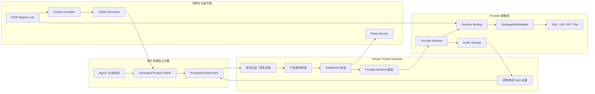

# 动态本体 OSDK v0.2 改版开发需求与实施计划

版本：2026-07-17  
适用项目：`dynamic-ontology-osdk-prototype`  
目标阶段：可信技术样机 v0.2  

## 1. 改版目标

当前 Demo 已经能讲清楚“动态本体、Product OSDK、Runtime、Policy、Receipt”的业务链路，但代码实现仍有明显演示化特征：

- OSDK 代码生成仍有产品级 hardcode。
- DOIR 主要来自 fixture，不是真正 Registry。
- Provider 字段映射写在 Runtime 代码里。
- 生成 SDK 依赖内部 `runtime.execute_action()`，没有独立客户侧 Runtime Client。
- 部署视图已经表达“客户侧 OSDK / 我方沙箱 OSDK 经网关调用 Runtime”，但代码层还没有把这条链路落成真实调用。

v0.2 改版目标是把当前 Demo 升级为：

```text
动态本体驱动的远程 OSDK 技术样机。
```

也就是：

```text
DOIR Registry 定义产品动作；
OSDK Generator 从 DOIR 动态生成可安装 SDK；
SDK 在客户侧或独立沙箱作为远程 workload 运行；
SDK 通过 ProviderRuntimeClient 调用 Simple Trusted Gateway；
Gateway 校验身份、授权和产品契约后转发到 Provider Runtime；
Runtime 在数据域内完成映射、计算、输出过滤和 Receipt 签发。
```

## 2. 一句话验收标准

新增产品或新增 action 时，研发人员不改 OSDK 生成器代码、不改客户侧 SDK 调用框架，只需要新增或修改：

- DOIR action schema。
- Product Projection。
- Provider Mapping 配置。
- Runtime action handler 或 adapter binding。

然后系统能够自动生成可安装 Python OSDK，远程 OSDK 通过简单网关调用 Runtime，并在 UI 中展示：

```text
DOIR -> OSDK Package -> ProviderRuntimeClient -> Gateway -> Runtime Binding -> Provider Data -> Receipt
```

## 3. 改版范围

### 3.1 v0.2 必须做

| 模块 | 要做什么 | 价值输出 |
| --- | --- | --- |
| DOIR Action Schema | 增加 `inputs`、`required`、`default`、`description`、`returns`、`depends_on` | OSDK 方法签名、MCP Tool、OpenAPI 可以从同一份本体动作生成 |
| 动态 OSDK Generator | 删除产品级 if-else hardcode，从 DOIR 动态生成 Client、方法、Pydantic 模型和 docstring | 证明不是两个手写 SDK 方法 |
| SDK Package Artifact | 输出 `generated/python/{product_id}/`，包含 `pyproject.toml`、README、模型和 client | OSDK 变成可安装、可交付、可被客户侧 workload 使用的真实包 |
| ProviderRuntimeClient | 实现 sync/async HTTP client，封装认证、超时、重试、错误处理和 request envelope | 生成 SDK 不再依赖内部 Demo Runtime 对象 |
| Simple Trusted Gateway | 新增轻量 HTTP 网关，作为远程 OSDK 与 Runtime 之间的唯一入口 | 演示客户侧 OSDK 不能直连 Runtime 或数据库 |
| Gateway 到 Runtime 转发 | Gateway 校验产品、action、entitlement 后调用 Provider Runtime | 让“远程 OSDK 经网关调用 Runtime”成为真实代码路径 |
| DOIR Registry Lite | 用 SQLite 保存 DOIR、产品版本、发布状态和编译 artifact | fixture 变成可管理、可版本化的本体资产 |
| Provider Mapping Registry | Provider 字段映射从配置加载，不写死在 Runtime | 支撑异构 Provider 动态接入 |
| Runtime Adapter 抽象 | 定义 SQL/GIS/REST adapter 接口，先实现 SQL/GIS demo adapter | 避免 `source_mapping` dict 继续扩散 |
| Demo Console 改造 | 展示远程 OSDK 调用代码、网关请求、Runtime 转发和 Receipt | 让非技术观众看懂远程 OSDK 的真实价值 |

### 3.2 v0.2 暂不做

| 暂不做 | 原因 |
| --- | --- |
| 生产级 Kubernetes 沙箱 | v0.2 只需证明独立 workload 和网关边界，不证明生产隔离强度 |
| 完整 PostgreSQL Registry | SQLite 足够支持技术样机和版本管理演示 |
| 完整 TypeScript SDK | 优先把 Python OSDK 跑通；TypeScript 可作为 v0.3 |
| 复杂隐私计算 / TEE / MPC | 本阶段重点是 OSDK、Gateway、Runtime Binding 链路 |
| 完整商业数据交易流程 | 本阶段只覆盖授权、调用、凭证和审计主链路 |

## 4. 改版后的目标架构



## 5. 远程 OSDK 调用链路

### 5.1 目标调用方式

生成后的 OSDK 应该支持这样的客户侧代码：

```python
from enterprise_energy_credit import EnterpriseEnergyCreditClient
from enterprise_energy_credit.runtime import ProviderRuntimeClient

runtime = ProviderRuntimeClient(
    base_url="http://localhost:8080",
    api_key="demo_key_bank_agent",
    requester_agent="agent:bank-risk",
    timeout=20,
)

client = EnterpriseEnergyCreditClient(runtime=runtime)

result = client.compute_credit_features(
    enterprise_id="91300000DEMO0007",
    months=12,
    entitlement_id="ent_demo_grid_001",
    provider_id="grid",
)

print(result.credit_score)
print(result.receipt_id)
```

关键点：

- `EnterpriseEnergyCreditClient` 是从 DOIR 动态生成的。
- `ProviderRuntimeClient` 是远程 HTTP client，不是内部 Demo Runtime 对象。
- 客户侧只知道产品、action、provider、entitlement 和业务参数。
- 客户侧不知道表名、字段映射、数据库连接串和 Runtime 内部实现。

### 5.2 Gateway 请求 Envelope

OSDK client 发给 Gateway 的请求应统一包装为：

```json
{
  "request_id": "req_...",
  "requester_agent": "agent:bank-risk",
  "provider_id": "grid",
  "product_id": "enterprise-energy-credit",
  "product_version": "enterprise-energy-credit@1.0.0",
  "action_id": "compute_credit_features",
  "entitlement_id": "ent_demo_grid_001",
  "purpose": "enterprise_credit_assessment",
  "payload": {
    "enterprise_id": "91300000DEMO0007",
    "months": 12
  },
  "client_timestamp": "2026-07-17T10:00:00+08:00"
}
```

Gateway 返回：

```json
{
  "request_id": "req_...",
  "status": "succeeded",
  "result": {
    "credit_score": 782,
    "risk_level": "low",
    "coverage_months": 12
  },
  "receipt_id": "rcpt_...",
  "policy_decision": "allow",
  "runtime_version": "grid-runtime@0.2.0"
}
```

### 5.3 Simple Trusted Gateway 最小职责

| 职责 | v0.2 实现 | 价值输出 |
| --- | --- | --- |
| 身份认证 | API key 或 HMAC demo token | 证明远程 OSDK 调用不是匿名直连 |
| 产品契约校验 | 校验 product/action 是否存在、版本是否匹配 | 防止调用不存在或未发布的产品动作 |
| Entitlement 校验 | 调用 Policy Service 或本地 Policy module | 证明授权编号真正被使用 |
| 参数校验 | 用 DOIR action input schema 校验 payload | 防止绕过 OSDK 直接传非法字段 |
| Runtime 路由 | 根据 `provider_id` 路由到对应 Runtime | 支撑同一 OSDK 跨 Provider 调用 |
| 请求审计 | 记录 request hash、payload hash、caller、product、action | 为 Receipt 和审计链路提供入口 |
| 输出过滤 | 至少校验 Runtime 返回字段符合 product schema | 防止 Runtime 错误返回超范围字段 |
| 错误归一 | 返回结构化错误码 | 让 SDK 能抛出 typed exception |

v0.2 Gateway 不需要承担生产级零信任网关能力，但必须证明：

```text
远程 OSDK 只能经 Gateway 进入 Runtime；
Gateway 是授权、契约、路由和审计的强制入口。
```

### 5.4 Gateway 最小 API

| API | 用途 |
| --- | --- |
| `GET /health` | 健康检查 |
| `GET /products` | 返回已发布产品目录 |
| `GET /products/{product_id}` | 返回产品 manifest、schema、actions |
| `POST /entitlements/verify` | 验证授权 |
| `POST /actions/execute` | 统一执行产品 action |
| `GET /jobs/{request_id}` | 查询异步任务状态，v0.2 可同步返回 |
| `GET /receipts/{receipt_id}` | 获取执行凭证 |

`POST /actions/execute` 是 v0.2 主链路接口。

## 6. 开发计划与价值输出

### Phase 0：范围冻结与验收基线

工期：1-2 人日  

| 计划点 | 交付物 | 价值输出 |
| --- | --- | --- |
| 冻结 v0.2 目标 | `v0.2-scope.md` 或本计划确认版 | 避免把技术样机做成生产平台 |
| 确认远程 OSDK 主链路 | 调用链路图和 API envelope | 明确客户侧 OSDK 与 Runtime 的边界 |
| 确认新增验证 action | 一个第三 action 或测试产品 | 用来证明 generator 不再 hardcode |
| 制定验收清单 | `v0.2-acceptance-checklist.md` | 后续开发不靠口头判断完成度 |

### Phase 1：DOIR Action Schema 改造

工期：2-3 人日  

| 计划点 | 交付物 | 价值输出 |
| --- | --- | --- |
| 扩展 `action_types.inputs` | DOIR YAML / fixture / schema 更新 | OSDK 方法参数从本体动作生成 |
| 定义类型映射 | `type_mapping.py` 或等价模块 | Python、JSON Schema、OpenAPI、MCP 同源 |
| 定义 required/default/description | action schema 规范 | 生成代码具备可读签名和说明 |
| 绑定 `returns` 到 ObjectType | 输出模型生成规则 | Pydantic response model 可动态生成 |
| 增加 schema 校验测试 | DOIR schema tests | 防止错误本体进入编译链路 |

验收：

- `compute_credit_features` 和 `assess_excavation_risk` 的外部入参不再写在 `_python_osdk()`。
- `depends_on` 只表示 Runtime 内部依赖，不再和外部 payload 混淆。

### Phase 2：动态 Python OSDK Generator

工期：4-6 人日  

| 计划点 | 交付物 | 价值输出 |
| --- | --- | --- |
| 删除产品 if-else 生成逻辑 | 新 `osdk_generator.py` | 证明 OSDK 不是按产品手写 |
| 生成 Pydantic input model | `models.py` | 调用参数可校验、可被 IDE/Agent 理解 |
| 生成 Pydantic output model | `models.py` | 返回结果不再是裸 dict |
| 生成 Client 方法签名 | `client.py` | action 自动变 SDK 方法 |
| 生成 docstring | action `description` + `depends_on` | 解释“外部参数”和“内部本体依赖”的区别 |
| 增加 golden file 测试 | `tests/test_osdk_generator.py` | 防止生成代码回归 |

验收：

- 新增 action 后，不改 generator 代码也能生成新方法。
- 生成方法签名包含参数类型、默认值和返回类型。
- docstring 能说明内部依赖字段，例如 `EnergyUsage.kwh`。

### Phase 3：SDK Package Artifact 与远程 Runtime Client

工期：4-6 人日  

| 计划点 | 交付物 | 价值输出 |
| --- | --- | --- |
| 生成 SDK 目录 | `generated/python/{product_id}/` | OSDK 变成真实 artifact |
| 生成 `pyproject.toml` | 可安装 Python 包 | 可 `pip install -e`，便于客户侧或沙箱运行 |
| 生成 `README.md` | SDK 使用说明 | 方便演示和交付 |
| 实现 `ProviderRuntimeClient` | sync HTTP client | OSDK 不再依赖内部 Runtime 对象 |
| 实现 `AsyncProviderRuntimeClient` | async HTTP client | 适配 Agent workflow 和异步任务 |
| 实现 typed errors | `PolicyDenied`、`EntitlementExpired`、`RuntimeError` 等 | 远程调用失败可被应用/Agent 正确处理 |
| 增加 sample app | `examples/remote_osdk_call.py` | 证明远程 OSDK 可独立运行 |

验收：

- 从生成目录安装 SDK 后，可以在独立 Python 进程中调用 Gateway。
- SDK 代码中没有 `TrustedDataDemo` 或内部 Runtime 类型依赖。
- Gateway 停止时，SDK 返回结构化连接错误。

### Phase 4：Simple Trusted Gateway

工期：5-7 人日  

| 计划点 | 交付物 | 价值输出 |
| --- | --- | --- |
| 新增 Gateway FastAPI 服务 | `core/trusted_data_demo/gateway.py` 或独立服务 | 远程 OSDK 有真实入口 |
| 实现 `/actions/execute` | 统一 action 执行接口 | 客户侧 SDK 不直连 Runtime |
| 实现 API key/HMAC demo auth | 认证中间件 | 证明远程调用有身份边界 |
| 实现产品契约校验 | product/action/version 校验 | 防止未发布能力被调用 |
| 实现 entitlement 校验 | 调 Policy Service | 授权编号从展示字段变成强制校验条件 |
| 实现 Runtime 路由 | provider registry | 支撑同一 OSDK 调多个 Provider |
| 实现请求/响应 hash | gateway audit event | Receipt 链路有入口 hash |
| 实现错误归一 | 标准错误 JSON | SDK 可映射 typed exception |

验收：

- OSDK 通过 Gateway 调用 `grid` Runtime 成功。
- OSDK 通过 Gateway 调用 `integrated-energy` Runtime 成功。
- entitlement 撤销后，Gateway 拒绝执行并返回 `PolicyDenied`。
- 直接调用 Runtime 的演示路径被 UI 标记为“不允许的内部路径”。

### Phase 5：DOIR Registry Lite

工期：5-8 人日  

| 计划点 | 交付物 | 价值输出 |
| --- | --- | --- |
| SQLite schema | `ontology_versions`、`product_versions`、`compile_artifacts` | 本体和产品版本从 fixture 变成持久化资产 |
| YAML/JSON import | registry import 命令或 API | 可接 OntoFlow 或其他上游动态本体平台输出 |
| publish 状态 | draft/published/deprecated | Gateway 只允许调用 published 产品 |
| diff 能力 | version diff API | 演示分类分级或 action 变化影响接口 |
| rollback 能力 | rollback API 或命令 | 支撑版本治理演示 |
| compiler 改为从 Registry 读取 | `compile_product(product_id, version)` | 编译链路真实化 |

验收：

- 删除 fixture 直接编译路径或仅保留为 seed/import。
- UI 能展示 DOIR version、product version、compile artifact version。

### Phase 6：Provider Mapping Registry 与 Runtime Adapter

工期：8-12 人日  

| 计划点 | 交付物 | 价值输出 |
| --- | --- | --- |
| Provider mapping YAML | `provider_id`、`mapping_version`、field bindings | Provider 映射不再 hardcode |
| Mapping Registry | SQLite 表或配置加载器 | 支持 Provider 注册自己的字段映射 |
| `OntologyFieldAdapter` 抽象 | adapter interface | SQL、GIS、REST、文件能力可统一接入 |
| SQL adapter demo | 用电征信字段映射 | 替代 Runtime 中 `source_mapping` dict |
| GIS adapter demo | 长春空间相交/缓冲/距离 | 长春场景不再只靠业务函数 |
| Runtime 动态加载 mapping | Runtime binding loader | 新 Provider 接入不改 Runtime 主逻辑 |
| Receipt 记录 mapping version | receipt 字段扩展 | 结果可追溯到具体 Provider 映射 |

验收：

- 修改 Provider mapping 配置后，Runtime trace 中的底层映射随之变化。
- 新增一个 demo Provider mapping，不改 OSDK generator 和 Gateway。
- 编译报告能指出缺失 mapping 的 action 不能发布。

### Phase 7：MCP/OpenAPI 同源生成

工期：3-5 人日  

| 计划点 | 交付物 | 价值输出 |
| --- | --- | --- |
| MCP Tool 从 action schema 生成 | `mcp_tools.json` | Agent 发现能力时看到真实参数 |
| OpenAPI 从 action schema 生成 | `openapi.json` | 人类应用和系统集成可复用同一契约 |
| Gateway API 与 OpenAPI 对齐 | `/actions/execute` schema | SDK、Agent、Gateway 不再各写一套参数 |
| compatibility report 增强 | breaking change 报告 | 解释为什么接口收缩或发布失败 |

验收：

- OSDK、MCP、OpenAPI 对同一 action 的参数定义一致。
- 修改 DOIR input 后，三类输出同步变化。

### Phase 8：Demo Console 机制展示改造

工期：4-6 人日  

| 计划点 | 交付物 | 价值输出 |
| --- | --- | --- |
| 新增“远程 OSDK 调用”视图 | UI panel | 用户看到客户侧/沙箱侧 OSDK 如何运行 |
| 展示 SDK package 文件树 | `generated/python/...` 文件列表 | 证明不是页面贴代码 |
| 展示调用代码 | `ProviderRuntimeClient` 示例 | 解释远程 OSDK 如何连接 Gateway |
| 展示 Gateway envelope | request/response JSON | 解释 entitlement、provider、product、action 如何被使用 |
| 展示 Gateway trace | Auth、Contract、Policy、Routing、Audit | 证明网关不是装饰性组件 |
| 展示 Runtime Binding | ontology field -> provider mapping | 解释动态本体如何拿到底层数据 |
| 展示 Receipt | receipt JSON + verifier | 解释执行凭证的可信含义 |

验收：

- 用户点击查询后，右侧执行进度保留完整链路。
- 可以清空执行日志。
- 能看到 OSDK 远程调用代码和 Gateway 实际请求。
- 能看到 Gateway 如何拒绝无效 entitlement。

### Phase 9：测试与验收硬化

工期：4-6 人日  

| 测试 | 价值输出 |
| --- | --- |
| DOIR schema tests | 保证本体动作定义合法 |
| OSDK generator golden tests | 保证动态生成稳定 |
| SDK install tests | 保证生成 artifact 可安装 |
| ProviderRuntimeClient tests | 保证远程调用、错误、超时处理可用 |
| Gateway policy tests | 保证授权失败、撤销、用途不符会被拒绝 |
| Runtime mapping tests | 保证 Provider mapping 动态加载 |
| Classification regression tests | 保证敏感字段不会进入 OSDK 和输出 |
| Receipt verification tests | 保证 input/output/product/mapping hash 篡改会失败 |
| UI E2E smoke test | 保证演示链路稳定 |

验收：

- 冷启动后 5 分钟内系统可用。
- 双场景演示仍能 8-10 分钟跑完。
- v0.2 新增“远程 OSDK 经网关调用 Runtime”演示 2-3 分钟跑通。

## 7. 工期估算

### 7.1 最小可信版本

只做最小链路：

- DOIR action inputs。
- 动态 OSDK generator。
- SDK package。
- ProviderRuntimeClient。
- Simple Gateway。
- Gateway 转发到现有 Runtime。
- UI 展示远程调用代码和 trace。

估算：

```text
15-22 人日。
```

适合快速证明：

```text
OSDK 已经从内部对象调用，升级成远程 gateway 调用。
```

### 7.2 推荐 v0.2 版本

包括：

- 最小可信版本全部内容。
- DOIR Registry Lite。
- Provider Mapping Registry。
- Runtime Adapter 基础抽象。
- MCP/OpenAPI 同源生成。
- 测试硬化。

估算：

```text
35-48 人日。
```

适合对外做技术样机和代码审查。

### 7.3 接近 PoC 版本

增加：

- 多服务 Docker Compose 拆分。
- 更完整 Policy/Audit 持久化。
- 更强沙箱隔离。
- TypeScript SDK。
- 异步任务队列。
- 更真实的 Provider adapter。

估算：

```text
55-80 人日。
```

适合进入客户联合 PoC。

## 8. 推荐团队分工

按 3.5 人小队：

| 角色 | 主要负责 |
| --- | --- |
| 后端/架构 1 人 | DOIR Registry、Gateway、Runtime Adapter、Provider Mapping |
| OSDK/Agent 1 人 | OSDK Generator、ProviderRuntimeClient、MCP/OpenAPI、sample app |
| 前端 1 人 | Demo Console 机制展示、远程 OSDK trace、Registry/Mapping 展示 |
| QA/DevOps 0.5 人 | Docker Compose、测试、验收脚本、演示稳定性 |

建议排期：

| 周期 | 重点 |
| --- | --- |
| Week 1 | DOIR action schema、动态 OSDK generator、SDK package、ProviderRuntimeClient |
| Week 2 | Simple Gateway、Gateway -> Runtime、Policy 校验、远程调用 UI |
| Week 3 | DOIR Registry、Provider Mapping Registry、Adapter 抽象、测试硬化 |

如果只做最小可信版本，可以压缩到 2 周。

## 9. 关键设计决策

### 9.1 Gateway 是必须组件，不是可选组件

原因：

- 远程 OSDK 如果直接调用 Runtime，就无法证明可信数据空间边界。
- Runtime 通常在 Provider 数据域内部，不应该直接暴露给客户侧。
- Gateway 是身份、合约、授权、审计、路由和限流的统一入口。

v0.2 Gateway 可以很简单，但必须存在。

### 9.2 OSDK 只负责开发体验，不负责可信边界

OSDK 可以做类型校验、参数封装和错误处理，但不能靠 SDK 自觉保证安全。真正强制边界在：

- Gateway。
- Policy。
- Runtime。
- Output Filter。
- Audit / Receipt。

### 9.3 Registry 先轻量，不做大平台

v0.2 用 SQLite 足够。重点不是数据库选型，而是把 fixture 变成：

- 可导入。
- 可发布。
- 可版本化。
- 可 diff。
- 可回滚。
- 可作为编译输入。

### 9.4 Adapter 接口要保守

不要设计成“Provider 给一段自由 SQL”。建议：

- SQL adapter 支持受限字段映射和受限表达式。
- GIS adapter 支持明确操作，例如 `intersects`、`buffer`、`distance`。
- REST adapter 支持白名单 endpoint 和参数模板。
- 所有 adapter 输出都必须回到本体字段或 action result schema。

## 10. v0.2 完成后的演示脚本变化

新增一个 2-3 分钟演示段：

1. 打开“部署视图 / 远程 OSDK”。
2. 展示生成 SDK package 文件树。
3. 展示客户侧代码：
   - import SDK。
   - 初始化 `ProviderRuntimeClient(base_url=Gateway)`。
   - 调用 `compute_credit_features(...)`。
4. 点击“执行远程调用”。
5. 右侧 trace 展示：
   - OSDK 组装 request envelope。
   - Gateway 验证 API key。
   - Gateway 校验 product/action/schema。
   - Gateway 校验 entitlement。
   - Gateway 路由到 `grid` 或 `integrated-energy` Runtime。
   - Runtime 加载 mapping。
   - Runtime 本地计算。
   - Gateway 返回 result 和 receipt。
6. 撤销 entitlement 后再次调用，展示 Gateway 拒绝。

演示话术：

```text
这不是 SDK 直接访问数据。
SDK 是客户侧或沙箱侧的远程 workload。
它只能把产品动作请求发到可信数据空间网关；
网关再根据授权、产品契约和 Provider 路由进入 Runtime。
原始数据、底层表、连接串和内部映射始终不暴露给客户侧 Agent。
```

## 11. 最终交付清单

| 交付物 | 价值 |
| --- | --- |
| `dynamic-osdk-v0.2-remote-gateway-development-plan.md` | 改版开发计划 |
| DOIR action schema | 动态 OSDK 生成源 |
| Dynamic OSDK Generator | 去除 hardcode |
| `generated/python/{product_id}/` | 可安装 OSDK artifact |
| `ProviderRuntimeClient` | 远程 OSDK 运行基础 |
| Simple Trusted Gateway | OSDK 到 Runtime 的可信入口 |
| DOIR Registry Lite | 本体版本化 |
| Provider Mapping Registry | 异构 Provider 动态映射 |
| Runtime Adapter interface | SQL/GIS/REST 扩展基础 |
| Demo Console 远程 OSDK 视图 | 机制透明展示 |
| 测试与验收脚本 | 支撑代码审查和复现 |

## 12. 总结建议

v0.2 的核心投资点应该从“再多做业务场景”转向“把机制做实”。

最关键的三件事：

```text
1. OSDK 真正从 DOIR 动态生成。
2. OSDK 作为远程 workload 经 Gateway 调 Runtime。
3. Runtime 通过 Registry/Adapter 动态绑定 Provider 数据。
```

做到这三点后，本项目的说服力会明显提升：

- 对业务方：能看懂数据不出域、Agent 可调用、结果可验证。
- 对技术方：能看出不是 hardcode Demo，而是有动态编译链路。
- 对 awiki.ai：能说明 Agent 网络不是只做聊天和消息，而是能组织远程 OSDK workload、可信网关、数据服务数字员工和 Provider Runtime 共同完成数据服务交易。

