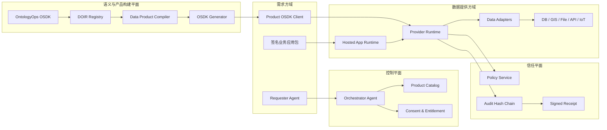
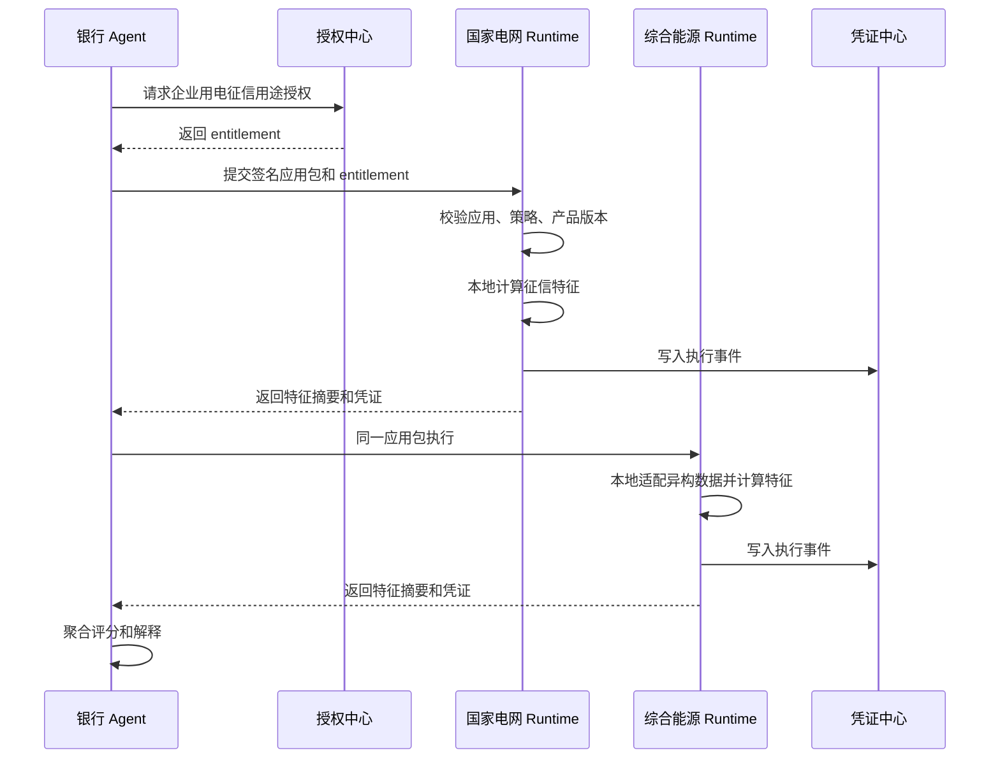

# 动态本体 OSDK 可信数据产品流转 Demo 原型设计与开发计划

基于本项目根目录下的《动态本体OSDK可信数据产品流转Demo方案.docx》展开。

本文面向最终方案制定者、原型研发负责人和 Demo 实施团队，目标是把原始方案中的业务设想拆成可执行的产品原型、系统架构、开发任务、验收标准与演示脚本。

## 1. 一句话目标

用一个可运行 Demo 证明：

用户的数据不需要离开数据域，治理规则可以编译成动态本体和 OSDK 能力，Agent 只能通过受控 OSDK 调用可信数据产品，从而快速开发精确、可验证、可审计的数据应用。

核心表达：

```text
数据不动，应用入场；用途受控，价值出域；过程留痕，结果可证。
```

## 2. 原型定位

本 Demo 不是数据交易平台、数据中台或完整隐私计算平台，而是一个“可信数据产品流转智能体”的原型底座。

它位于三类系统之间：

- 数据提供方的数据域、数据中台、ODS/DWD/DWS/ADS、GIS/CIM/IoT 等系统。
- 数据需求方的 Agent、业务应用、审批系统、银行风控应用、施工安全应用。
- 治理与监管侧的授权、分类分级、质量、血缘、审计、凭证系统。

原型重点证明以下能力：

- 通过动态本体屏蔽不同数据源的表结构、字段名、编码和平台差异。
- 通过 Product Service OSDK 暴露稳定、面向业务意图的能力，而不是暴露表、SQL 或原始文件。
- 通过 Provider Runtime 在数据域内执行应用和计算，只让用途允许的结果出域。
- 通过策略、签名、哈希链和执行凭证证明“谁在什么授权下，用哪个版本的应用、产品、本体和映射，得到了什么结果”。

## 3. 推荐 Demo 结构

采用“一套可信数据产品流转底座，两套业务剧本”。

### 3.1 共用底座

共用底座包括：

- DOIR Registry：动态本体中间表示注册表。
- OntologyOps OSDK：治理侧 OSDK，用于发现数据、生成映射、质量检查、分类分级、产品编译。
- Product Compiler：把领域动态本体裁剪为面向用途的产品本体投影。
- OSDK Generator：生成 Python SDK、TypeScript SDK、OpenAPI 和 MCP Tool。
- Policy Service：执行用途、主体、期限、字段粒度、输出粒度和调用配额策略。
- Provider Runtime：在数据提供方域内执行查询、动作、应用包和输出过滤。
- Hosted App Runtime：加载需求方提交的签名应用包，注入受限 OSDK handle。
- Audit & Receipt Service：写入哈希链事件，生成签名执行凭证。
- Demo Console：承载治理工作台、产品工厂、授权中心、执行拓扑和凭证中心。

### 3.2 业务剧本一：企业用电征信

主剧本。用于证明：

- 银行风控应用不用知道国家电网和综合能源公司的表名、字段名和数据平台。
- 同一个银行征信应用可以在两个异构数据提供方域内执行。
- 原始用电明细、缴费流水、企业账号信息不离开数据域。
- 输出的是被授权的征信特征、风险等级、覆盖月数、解释摘要和执行凭证。

推荐演示名称：

```text
企业用电征信可信数据产品
```

### 3.3 业务剧本二：长春城市生命线开挖风险

行业扩展剧本。用于证明：

- 现有城市生命线数据治理、ODS/DWD/DWS/ADS、GIS/CIM/IoT 可以被动态本体接入，而不是被重建。
- 管线精确坐标、拓扑、业主和监测序列可以留在本地，仅输出风险等级、影响类型、建议和凭证。
- 分类分级变化会影响产品投影和 OSDK 接口，而不是只停留在治理标签层。

推荐演示名称：

```text
地下管线开挖风险评估可信数据产品
```

## 4. 总体架构



### 4.1 控制平面

控制平面负责身份、产品发现、授权流转和任务编排。

Demo 中可以实现为轻量状态机，不需要完整 ANP 协议栈，但接口设计要保持 ANP-compatible：

- Agent Description：声明 Agent 身份、能力、回调地址、可接受任务类型。
- Task Envelope：描述产品请求、授权请求、应用提交、执行请求和凭证查询。
- Handoff Event：记录从需求方 Agent 到授权方、治理方、数据方 Runtime 的任务交接。

重要边界：

- ANP 或 Agent 协议只负责身份发现和任务流转。
- 字段权限、数据访问、用途检查和输出过滤必须由 Policy Service 和 Provider Runtime 执行。
- Agent 不能直接生成生产 SQL 或绕过 OSDK 访问原始数据。

### 4.2 语义与产品构建平面

该平面负责把数据资产变成可发布的数据产品。

处理链路：

```text
L0 物理源绑定
  -> L1 治理资产绑定
  -> L2 领域动态本体
  -> L3 产品本体投影
  -> L4 Product OSDK 与运行时绑定
```

每层职责：

- L0：绑定数据表、字段、API、GIS 图层、文档、IoT topic、文件和刷新周期。
- L1：绑定数据标准、代码集、质量规则、血缘、责任人、分类分级。
- L2：生成领域对象、属性、关系、查询和动作。
- L3：按用途、角色、授权和输出粒度裁剪成数据产品。
- L4：生成 SDK、MCP Tool、OpenAPI、Runtime Binding 和执行凭证模型。

### 4.3 执行平面

执行平面负责“应用入场”和“结果出域”。

基本流程：

1. 需求方提交签名应用包。
2. Runtime 校验应用 digest、签名、产品版本、授权和用途。
3. Hosted App Runtime 以沙箱方式运行应用。
4. 沙箱只注入受限 Product OSDK Handle。
5. Provider Runtime 执行命名 Query/Action，不开放自由 SQL。
6. Runtime 对输出执行白名单、脱敏、聚合、精度限制和推断风险检查。
7. 只将合规结果、摘要、质量信息和凭证返回给需求方。

Demo 的隔离不主张证明生产级安全。MVP 只需证明控制面和能力边界：

- 应用无数据库连接串。
- 应用无自由网络出域。
- 应用只能调用 OSDK 暴露的方法。
- 审计日志能证明没有原始明细行或敏感坐标出域。

### 4.4 信任平面

信任平面负责授权、策略、审计、签名和验证。

MVP 采用低成本实现：

- Ed25519 签名。
- SQLite 或 JSONL 审计事件。
- 哈希链串联事件。
- 执行凭证使用 JSON + JWS。
- Receipt Verifier 提供本地校验接口。

凭证字段建议：

```yaml
request_id: req_...
purpose: enterprise_credit_assessment
requester_agent: agent:bank-risk
provider_agent: agent:grid-runtime
data_subject: enterprise:913...
consent_digest: sha256:...
entitlement_id: ent_...
application_digest: sha256:...
ontology_version: energy-credit-domain@1.0.0
mapping_version: grid-mapping@1.0.0
product_version: enterprise-energy-credit@1.0.0
runtime_version: provider-runtime@0.1.0
data_window: "2025-07..2026-06"
quality_snapshot:
  coverage_months: 12
  missing_rate: 0.01
input_hash: sha256:...
output_hash: sha256:...
policy_decision:
  raw_export: false
  network_egress: false
  output_granularity: feature_summary
status: success
previous_event_hash: sha256:...
provider_signature: ed25519:...
```

## 5. 动态本体与产品编译设计

### 5.1 DOIR 最小对象

DOIR v0.2 建议覆盖以下对象：

- `SourceDataset`
- `SourceField`
- `GovernanceTerm`
- `QualityRule`
- `ClassificationPolicy`
- `ObjectType`
- `PropertyType`
- `LinkType`
- `QueryType`
- `ActionType`
- `ProductProjection`
- `RuntimeBinding`
- `Entitlement`
- `ApplicationManifest`
- `ExecutionReceipt`

### 5.2 分类分级到接口暴露规则

分类分级必须影响编译和运行时，而不是只是展示标签。

推荐规则：

| 暴露级别 | OSDK 表现 | Runtime 行为 |
| --- | --- | --- |
| `HIDDEN` | 不生成字段和方法 | 禁止读取、禁止输出、禁止解释中泄露 |
| `INTERNAL_ONLY` | 仅 OntologyOps OSDK 可见 | 只能治理侧使用 |
| `COMPUTE_ONLY` | 不生成 read 方法，只能被动作内部使用 | 可本地计算，不可原值返回 |
| `MASKED` | 生成脱敏字段类型 | Runtime 强制脱敏 |
| `AGGREGATE_ONLY` | 只生成聚合 Query | 强制最小样本量和精度限制 |
| `EXTERNAL_RESULT` | 可作为产品结果字段 | 仍受用途、期限、配额、审计约束 |

### 5.3 Product Compiler 输入输出

输入：

- 领域 DOIR。
- 产品定义。
- 用途合同。
- 分类分级策略。
- 质量门槛。
- 授权模板。
- Runtime 能力声明。

输出：

- `product_manifest.yaml`
- `product_schema.json`
- `python_osdk/`
- `typescript_osdk/`
- `mcp_tools.json`
- `openapi.yaml`
- `runtime_binding.yaml`
- `quality_certificate.json`
- `compatibility_report.md`

编译检查：

- 映射覆盖率是否达标。
- 产品输出是否包含禁止字段。
- Query/Action 是否只依赖允许字段。
- 输出粒度是否符合目的。
- 数据质量是否满足发布门槛。
- 新版本是否破坏已有应用。
- Runtime 是否具备执行能力。

## 6. 业务剧本一：企业用电征信

### 6.1 演示故事

银行希望评估某企业的经营稳定性，但不能获得企业原始用电明细和缴费流水。

企业授权后，银行提交一个签名风控应用。该应用分别进入国家电网数据域和综合能源公司数据域，在本地调用同一个 `EnterpriseEnergyCredit OSDK`，得到可组合的征信特征。银行侧 Agent 只汇总特征、计算最终风险等级，并查看凭证。

### 6.2 参与方

- 需求方：银行风控部门。
- 数据主体：被评估企业。
- 数据提供方 A：国家电网。
- 数据提供方 B：综合能源公司。
- 治理方：数据产品运营人员。
- 审计方：监管或内审角色。

### 6.3 示例数据源

国家电网侧：

- `customer`
- `monthly_usage`
- `payment`
- `meter_event`

综合能源侧：

- `enterprise`
- `billing`
- `charge`
- `contract_account`

字段异构示例：

| 业务含义 | 国家电网字段 | 综合能源字段 | 映射方式 | 产品暴露 |
| --- | --- | --- | --- | --- |
| 企业统一社会信用代码 | `customer.unified_credit_code` | `enterprise.enterprise_no` | 实体解析 | `COMPUTE_ONLY` |
| 用电月份 | `monthly_usage.usage_month` | `billing.period_code` | 日期标准化 | `INTERNAL_ONLY` |
| 月度电量 | `monthly_usage.total_kwh` | `billing.energy_qty` | 单位换算 | `COMPUTE_ONLY` |
| 缴费状态 | `payment.status` | `charge.settle_status` | 代码映射 | `AGGREGATE_ONLY` |
| 逾期天数 | `paid_date - due_date` | `settle_date - deadline` | 本地计算 | `AGGREGATE_ONLY` |
| 用电波动率 | 12 个月电量序列 | 12 个月能源账单 | 特征计算 | `EXTERNAL_RESULT` |

### 6.4 领域本体

核心对象：

- `Enterprise`
- `EnergyAccount`
- `UsagePeriod`
- `BillingRecord`
- `ConsentGrant`
- `ApplicationPackage`
- `ExecutionJob`
- `CreditFeature`
- `CreditResult`

核心查询：

- `getUsageSummary(enterprise_id, months)`
- `getPaymentBehavior(enterprise_id, months)`
- `getCoverageQuality(enterprise_id, months)`

核心动作：

- `computeCreditFeatures`
- `issueExecutionReceipt`

### 6.5 Product OSDK 设计

Python 示例：

```python
client = EnterpriseEnergyCreditClient(runtime_handle)

summary = client.energy_usage.summary(
    enterprise_id="913...",
    months=12,
)

payment = client.billing.payment_behavior(
    enterprise_id="913...",
    months=12,
)

features = client.credit.compute_features(
    enterprise_id="913...",
    months=12,
)
```

MCP Tool 示例：

- `describe_enterprise_energy_credit_product`
- `request_energy_credit_entitlement`
- `submit_energy_credit_application`
- `execute_energy_credit_features`
- `get_energy_credit_receipt`
- `verify_energy_credit_receipt`

### 6.6 输出结果

允许输出：

- `credit_score`
- `risk_level`
- `coverage_months`
- `usage_stability_index`
- `late_payment_count_band`
- `provider_count`
- `quality_summary`
- `explanation`
- `execution_receipt`

禁止输出：

- 原始月度用电明细。
- 逐笔缴费流水。
- 账号、户号、表号。
- 可反推出企业敏感经营细节的细粒度序列。

### 6.7 端到端流程



### 6.8 验收点

- 同一银行应用包可在两个异构 Provider Runtime 执行。
- 银行应用代码不包含任何表名、字段名和连接串。
- 审计日志中没有原始用电明细或缴费流水出域。
- 调整字段分类后，OSDK 接口和 Runtime 策略同步变化。
- 每次执行都能生成可验证凭证。

## 7. 业务剧本二：长春城市生命线开挖风险

### 7.1 演示故事

施工单位计划在某区域开挖。它不应获得地下管线精确坐标、完整拓扑和监测明细，但需要知道该开挖是否高风险、涉及哪些资产类型、建议采取哪些保护措施。

城市生命线数据域通过动态本体把管线、工程、历史隐患、监测指标和规范规则编译成“地下管线开挖风险评估产品”。施工单位提交项目范围和开挖参数，应用进入数据域本地执行，输出风险结果和凭证。

### 7.2 与现有数据中台的关系

原型不重建长春现有治理平台，而是在其上增加动态本体和产品 OSDK 层。

映射关系：

- ODS：作为 L0 物理源和源证据。
- DWD：作为 L1 标准、代码、清洗结果和治理资产绑定。
- DWS：作为 L2 计算属性、指标和质量快照。
- ADS：作为 Runtime Adapter 的候选输入，而不是最终产品接口。
- 治理模块：成为 OntologyOps OSDK 的能力来源。
- 动态本体和产品层：负责用途投影、接口裁剪、质量门槛、版本和凭证。

### 7.3 示例数据源

- 地下管线 GIS 图层。
- 管线材质、管径、埋深、权属、年代。
- 道路、地块、施工许可范围。
- 历史事故、隐患、维修记录。
- IoT 监测指标和告警。
- 城市生命线安全规范和保护距离规则。

### 7.4 产品输入输出

输入：

- `excavation_area`: GeoJSON polygon。
- `excavation_depth`: number。
- `construction_method`: enum。
- `project_id`: string。

允许输出：

- `overall_risk`
- `affected_asset_types`
- `affected_segment_count`
- `risk_reasons`
- `protection_recommendations`
- `quality_summary`
- `execution_receipt`

禁止输出：

- 精确管线坐标。
- 完整管网拓扑。
- 权属单位细节。
- 原始监测时间序列。
- 可还原敏感基础设施位置的明细。

### 7.5 领域本体

核心对象：

- `PipelineSegment`
- `PipelineNetwork`
- `ExcavationProject`
- `ConstructionArea`
- `HazardEvent`
- `MonitoringSignal`
- `ProtectionRule`
- `RiskAssessment`

核心查询：

- `findNearbyPipelineRisk(area, depth, method)`
- `getMonitoringRiskSummary(area, time_window)`
- `getHistoricalHazardSummary(area, years)`

核心动作：

- `assessExcavationRisk`
- `generateProtectionAdvice`
- `issueExecutionReceipt`

### 7.6 Product OSDK 设计

Python 示例：

```python
client = ExcavationRiskClient(runtime_handle)

result = client.risk.assess(
    excavation_area=geojson_polygon,
    excavation_depth=3.5,
    construction_method="MECHANICAL",
    project_id="CC-2026-001",
)

receipt = client.receipts.get(result.job_id)
```

MCP Tool 示例：

- `describe_excavation_risk_product`
- `request_excavation_risk_entitlement`
- `assess_excavation_risk`
- `get_excavation_risk_receipt`
- `verify_excavation_risk_receipt`

### 7.7 差异化演示动作

建议安排一个“分类分级变化”的现场动作：

1. 治理人员把“管线精确坐标”从重要数据提升为核心数据。
2. OntologyOps Agent 执行影响分析。
3. Product Compiler 生成新产品版本。
4. 新 OSDK 中不出现坐标读取接口，坐标变为 `COMPUTE_ONLY`。
5. 开挖风险评估动作仍能在数据域内使用坐标计算。
6. 输出仍只包含风险等级、资产类型、段数和建议。

这个动作能证明分类分级不是静态标签，而是动态本体、产品编译和 Runtime 策略的输入。

## 8. Demo Console 设计

Demo Console 推荐做成 6 个页签。

### 8.1 场景总览

展示：

- 当前场景：企业用电征信 / 长春开挖风险。
- 参与方状态。
- 产品版本、本体版本、映射版本。
- 最近一次执行结果。
- 快速进入“治理、发布、授权、执行、凭证”。

### 8.2 治理工作台

展示：

- 数据源列表。
- 字段 profile。
- 标准绑定。
- 分类分级。
- 质量规则。
- 动态本体映射建议。
- 置信度、证据和人工确认状态。

关键交互：

- 接受或拒绝字段映射。
- 修改字段分类。
- 查看影响分析。
- 触发重新编译。

### 8.3 产品工厂

展示：

- 产品用途。
- 输入合同。
- 输出合同。
- 允许 Query/Action。
- 质量门槛。
- 输出粒度。
- 兼容性检查。
- SDK/MCP/OpenAPI 生成结果。

关键交互：

- 发布 `enterprise-energy-credit@1.0.0`。
- 发布 `excavation-risk@1.0.0`。
- 查看产品投影中被裁剪掉的字段。

### 8.4 产品目录

展示：

- 产品说明。
- 覆盖范围。
- 可申请用途。
- 质量证书。
- Runtime 提供方。
- 授权模板。
- 计量占位信息。

关键交互：

- 需求方 Agent 选择产品。
- 发起授权申请。

### 8.5 授权中心

展示：

- 数据主体。
- 请求方。
- 用途。
- 有效期。
- 调用次数。
- 输出粒度。
- 可撤销状态。

关键交互：

- 企业代表批准银行征信用途。
- 城市数据负责人批准施工安全评估用途。
- 撤销授权后再次执行失败。

### 8.6 执行拓扑

展示：

- 应用包 digest。
- Product OSDK Handle。
- Provider Runtime。
- Policy Check。
- Local Compute。
- Output Filter。
- Result Egress。
- Audit Event。

关键交互：

- 启动应用入场执行。
- 查看每一步耗时和策略决策。
- 显示“无原始数据出域”证据。

### 8.7 凭证中心

展示：

- 执行凭证 JSON。
- 授权链。
- 应用 digest。
- 本体、映射、产品、Runtime 版本。
- 输入 hash、输出 hash。
- 哈希链 previous hash。
- 签名验证结果。

关键交互：

- 复制凭证 ID。
- 本地验证签名。
- 对比两次执行的版本变化。

## 9. 开发拆解

### 9.1 推荐仓库结构

```text
core/
  doir-registry/
  ontologyops-osdk/
  product-compiler/
  osdk-generator/
  policy-service/
  provider-runtime/
  application-host/
  audit-service/
adapters/
  anp/
  data-platform/
  gis/
scenarios/
  power-credit/
    data/
    mappings/
    product/
    apps/
  changchun-lifeline/
    data/
    mappings/
    product/
    apps/
ui/
  demo-console/
docs/
  demo-script.md
  acceptance-report.md
```

### 9.2 后端服务

| 服务 | MVP 职责 | 技术建议 |
| --- | --- | --- |
| DOIR Registry | 保存本体、映射、产品版本 | FastAPI + SQLite/DuckDB + Pydantic |
| OntologyOps OSDK | 治理能力封装 | Python package |
| Product Compiler | 产品投影、质量门槛、接口裁剪 | Python CLI + library |
| OSDK Generator | 生成 SDK/MCP/OpenAPI | Jinja2 templates |
| Policy Service | 用途、字段、期限、配额、输出策略 | FastAPI + rule engine |
| Provider Runtime | 本地执行 Query/Action | FastAPI + DuckDB/SQLite |
| Application Host | 加载签名应用包并注入 OSDK | Python subprocess/Docker sandbox |
| Audit Service | 哈希链事件和凭证签名 | SQLite/JSONL + Ed25519 |

### 9.3 前端

技术建议：

- React + Vite。
- TanStack Table 展示治理表格。
- React Flow 展示执行拓扑。
- Monaco 或 JSON viewer 展示凭证。
- CSS 采用克制的工作台风格，不做营销页。

核心页面：

- `/overview`
- `/governance`
- `/product-factory`
- `/catalog`
- `/consent`
- `/runtime`
- `/receipts`

### 9.4 Agent 能力边界

Demo 中 Agent 允许：

- 解析需求。
- 选择数据产品。
- 发起授权。
- 提交应用包。
- 调用 OSDK/MCP Tool。
- 总结结果和解释。
- 查询凭证。

Demo 中 Agent 不允许：

- 直接访问数据库。
- 生成自由 SQL 执行。
- 修改分类分级绕过审批。
- 读取未发布字段。
- 绕过 Provider Runtime 获取原始文件。

## 10. 四周 MVP 计划

### Phase 0：范围冻结，2 天

任务：

- 冻结两个业务剧本的输入、输出和禁止输出。
- 冻结字段分类规则和凭证字段。
- 确定 Demo Console 信息架构。
- 确定合成数据规模。

交付：

- `demo-contract.md`
- `data-dictionary.md`
- `acceptance-checklist.md`
- UI wireframe 草图。

验收：

- 两个产品的输入输出合同冻结。
- 8-10 分钟演示脚本冻结。

### Week 1：DOIR 与样例数据

任务：

- 扩展 DOIR Schema 到 v0.2。
- 准备国家电网和综合能源公司合成数据。
- 准备长春生命线合成 GIS/监测/隐患数据。
- 编写两个场景的 L0/L1/L2 映射 YAML。
- 实现 DOIR Registry 的基础 CRUD 和版本读取。

交付：

- `specs/doir-v0.2.schema.json`
- `scenarios/power-credit/mappings/*.yaml`
- `scenarios/changchun-lifeline/mappings/*.yaml`
- 合成数据和数据字典。

验收：

- 两个异构用电数据源能映射到统一 `EnterpriseEnergyCredit` 领域本体。
- 长春数据源能映射到 `PipelineSegment`、`ExcavationProject`、`RiskAssessment`。

### Week 2：产品编译与 OSDK 生成

任务：

- 实现 Product Compiler。
- 实现分类分级到接口暴露的编译规则。
- 生成 Python SDK、MCP Tool、OpenAPI。
- 实现质量门槛检查和兼容性报告。
- 实现基础 Policy Service。

交付：

- `core/product-compiler`
- `core/osdk-generator`
- `core/policy-service`
- 两个产品的 release package。

验收：

- 修改字段分类后，重新编译能改变 SDK/MCP 接口。
- 产品编译会拒绝包含禁止输出字段的定义。
- 生成的 SDK 能调用 mock Runtime。

### Week 3：Provider Runtime 与企业用电征信闭环

任务：

- 实现两个 Provider Runtime：国家电网、综合能源。
- 实现企业用电征信特征计算。
- 实现授权中心 MVP。
- 实现应用包 manifest、digest 校验和受限 OSDK 注入。
- 实现审计事件和执行凭证。
- 实现 Demo Console 的征信主链路。

交付：

- `scenarios/power-credit/apps/bank-risk-app`
- `provider-runtime-grid`
- `provider-runtime-energy`
- `audit-service`
- 企业用电征信 E2E 演示。

验收：

- 同一银行应用包在两个 Provider Runtime 执行成功。
- 银行侧只拿到特征摘要和凭证。
- 撤销授权后执行失败并产生可解释策略拒绝记录。

### Week 4：长春场景、统一控制台与演示硬化

任务：

- 实现长春开挖风险 Provider Runtime。
- 实现简化空间计算：GeoJSON intersection、buffer、距离、风险规则。
- 实现长春产品工厂流程。
- 实现执行拓扑、凭证中心和版本变化演示。
- 完成 Demo 脚本、部署脚本和验收报告。

交付：

- `scenarios/changchun-lifeline/apps/excavation-risk-app`
- 长春开挖风险 E2E 演示。
- Demo Console 完整流程。
- `docs/demo-script.md`
- `docs/acceptance-report.md`

验收：

- 两个场景能在 8-10 分钟内稳定演示。
- 分类分级变化能触发产品版本变化和接口裁剪。
- 凭证可验证，且能展示版本链和授权链。

### Optional Week 5-6：真实环境适配与安全增强

可选增强：

- 对接真实数据中台或样例 PostgreSQL。
- Docker Compose 多服务部署。
- Runtime 网络 egress 限制。
- 更严格的应用沙箱。
- 结果推断风险检查。
- 更完整的 ANP adapter。
- PDF/Word 形式的产品说明书和项目汇报材料。

## 11. 团队与人日估算

推荐最小团队：

- 架构/后端负责人：1 人。
- Agent/OSDK 工程师：1 人。
- 前端工程师：1 人。
- QA/DevOps：0.5 人。
- 业务专家：电力征信、城市生命线各 0.2-0.5 人参与评审。

四周 MVP 估算：

| 模块 | 人日 |
| --- | ---: |
| DOIR Schema 与 Registry | 7-9 |
| 产品编译和 OSDK 生成 | 9-12 |
| Policy、授权和凭证 | 7-9 |
| Provider Runtime 与应用沙箱 | 10-14 |
| 企业用电征信场景 | 7-9 |
| 长春开挖风险场景 | 8-10 |
| Demo Console | 10-12 |
| 测试、脚本、部署和演示硬化 | 6-8 |

总计约 64-83 人日。若只做企业用电征信单场景，可压缩到 35-45 人日。

## 12. 验收标准

### A1 异构适配

国家电网和综合能源公司使用不同字段、表结构和编码；银行应用代码不变。

### A2 数据边界

需求方结果、网络日志和审计凭证中不出现原始用电明细、缴费流水、精确管线坐标或原始监测序列。

### A3 治理驱动

字段分类分级变化会影响产品投影、OSDK 接口、Runtime 策略和凭证记录。

### A4 产品版本

每次产品发布都有 `ontology_version`、`mapping_version`、`product_version` 和兼容性报告。

### A5 受控执行

应用包必须签名并通过授权校验；应用只能调用注入的 OSDK handle。

### A6 Agent 边界

Agent 能编排产品申请、授权、执行和解释，但不能绕过 OSDK 获取数据。

### A7 凭证可验证

执行凭证包含授权、应用、产品、本体、映射、Runtime、输入输出 hash、质量快照和签名。

### A8 演示效率

单场景 4-6 分钟完成，双场景 8-10 分钟完成。

## 13. 演示脚本

### 13.1 双场景 10 分钟脚本

1. 场景总览，说明“数据不动，应用入场；用途受控，价值出域”，30 秒。
2. 企业用电征信治理工作台，展示两个异构数据源和统一本体映射，90 秒。
3. 产品工厂发布企业用电征信产品，展示哪些字段被裁剪，60 秒。
4. 银行发起授权，企业代表批准用途、期限和输出粒度，90 秒。
5. 银行应用进入两个 Provider Runtime 执行，展示拓扑和策略检查，120 秒。
6. 银行获得评分、解释、覆盖月数和执行凭证，60 秒。
7. 切换长春场景，展示开挖风险产品和空间输入，60 秒。
8. 修改“管线精确坐标”分类，重新编译产品，展示 OSDK 接口变化，90 秒。
9. 执行开挖风险评估，展示结果出域和凭证，90 秒。
10. 总结三点价值：异构适配、治理可执行、结果可验证，30 秒。

### 13.2 单场景 5 分钟脚本

优先选择企业用电征信：

1. 展示两个异构 Provider 数据源。
2. 展示统一动态本体和产品 OSDK。
3. 发起授权。
4. 应用入场执行。
5. 返回结果和凭证。
6. 修改分类并展示接口收缩。

## 14. 风险与建议

| 风险 | 表现 | MVP 处理 | 后续增强 |
| --- | --- | --- | --- |
| 把 Docker 沙箱误认为生产可信执行 | 安全承诺过高 | 明确只证明能力边界 | 引入 TEE/MPC/联邦分析 |
| Agent 权限过大 | Agent 可猜 SQL 或绕过策略 | 只暴露命名 Query/Action/MCP Tool | 引入策略证明和更严格权限模型 |
| 映射自动化不可靠 | LLM 误映射字段 | 置信度、证据、人工确认 | 样本校验和回归测试 |
| 产品接口频繁漂移 | 应用适配成本高 | 产品版本和兼容性报告 | SemVer 和迁移工具 |
| 输出反推敏感数据 | 聚合结果过细 | 最小样本量、精度限制、白名单 | 差分隐私和推断风险检测 |
| 范围过大 | 四周内无法稳定演示 | 主打企业用电征信，长春做产品工厂扩展 | 分阶段接入更多行业 |

## 15. 立即建议

1. 先把企业用电征信定为主线闭环，确保 4 周内能稳定演示。
2. 长春场景重点展示“治理资产到产品 OSDK”的生产过程，不要一开始追求真实 GIS 全量能力。
3. DOIR v0.2 要优先支持分类分级、产品投影、Runtime Binding 和凭证，不要只做对象/字段模型。
4. Product Compiler 是原型成败关键，应优先实现“字段裁剪、质量门槛、策略绑定、SDK 生成”四件事。
5. 演示时少讲 Agent 数量，多讲“治理规则被编译成产品能力，应用被控制在数据域内，结果可验证”。
